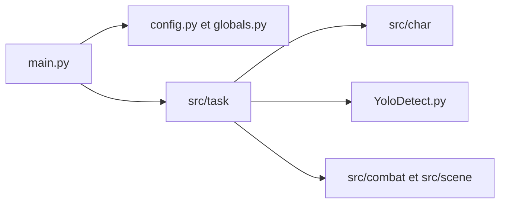

# ok-oldking/ok-wuthering-waves

> Automatisation par reconnaissance d'image du jeu Wuthering Waves sous Windows, avec mode arrière-plan.

## Le problème
Les tâches répétitives du jeu (combat, ramassage, quêtes quotidiennes) prennent du temps de jeu.

## Ce que ça fait vraiment
Programme Windows basé sur le framework ok-script : détection d'éléments à l'écran (modèle YOLO ONNX), gestion des personnages, tâches automatisées (combat, ramassage, connexion), interaction par simulation d'entrées win32, exécution fenêtre masquée avec coupure du son. README en chinois et anglais.

## Comment c'est branché


## Essayer
```bash
pip install -r requirements.txt --upgrade
python main.py
python main_debug.py
ok-ww.exe -t 1 -e
```

## Coût et pièges
Gratuit. Le README cite l'éditeur du jeu : bannissement ou gel du compte possible pour les macros et outils tiers ; l'utilisateur assume tous les risques.

## Ce que ce n'est pas
Pas un outil d'IA générale : la partie vision sert un seul jeu. Le README affirme ne donner aucun avantage déloyal, ce que l'éditeur cité contredit dans sa politique.

## Alternatives
Projets voisins basés sur ok-script, listés dans le README : ok-genshin-impact, ok-gf2, ok-starrailassistant.

## Pour toi
À ignorer : automatisation de jeu avec risque de bannissement de compte, sans usage data/IA/MLOps.

