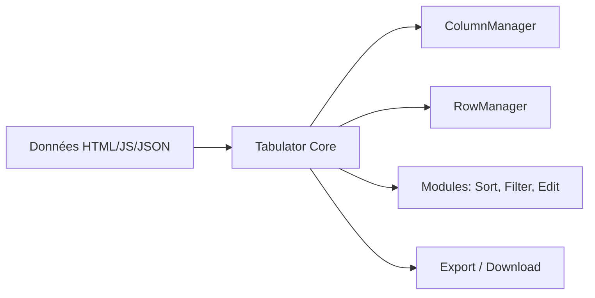

# olifolkerd/tabulator

> Bibliothèque JavaScript de tableaux interactifs à partir de HTML, tableaux JS ou JSON.

## Le problème
Afficher, trier et éditer de gros jeux de données tabulaires dans une page web demande beaucoup de code.

## Ce que ça fait vraiment
Génère un tableau depuis un élément HTML, un tableau JS ou du JSON. Modules d'édition, format, tri, filtre, colonnes gelées, redimensionnement, arbres, groupes, import/export. Marche avec React, Angular et Vue.

## Comment c'est branché


## Essayer
```bash
npm install tabulator-tables --save
npm run test:unit
npm run build
npx playwright test
```

## Coût et pièges
Gratuit (MIT). 400 issues ouvertes ; le README ne détaille pas la gouvernance.

## Ce que ce n'est pas
Ni un tableur ni un outil de BI ; c'est un composant front.

## Alternatives
Aucune alternative nommée dans le README.

## Pour toi
Surveiller : pratique pour un tableau de bord ou une petite app de données en JS, sans être central.

