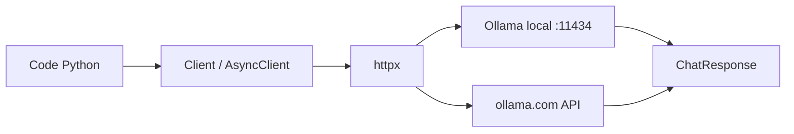

# ollama/ollama-python

> Client Python officiel de l'API REST Ollama, synchrone, asynchrone et en flux.

## Le problème
Appeler un modèle servi par Ollama en HTTP brut oblige à écrire soi-même le parsing du flux,
la gestion d'erreurs et les types de réponse.

## Ce que ça fait vraiment
Expose `chat`, `generate`, `list`, `show`, `create`, `copy`, `delete`, `pull`, `push`, `embed`, `ps`,
calqués sur l'API REST. Les réponses sont typées (`ChatResponse`, accès par clé ou par attribut).
`stream=True` renvoie un générateur ; `AsyncClient` renvoie un générateur asynchrone. `Client` accepte
un `host` et des en-têtes, et passe tout kwarg supplémentaire à `httpx.Client`. Les erreurs lèvent
`ollama.ResponseError` avec `status_code`.

## Comment c'est branché


## Essayer
```bash
pip install ollama
ollama pull gemma4
ollama signin
export OLLAMA_API_KEY=your_api_key
```

## Coût et pièges
Ollama doit être installé et lancé, et le modèle téléchargé au préalable. Les modèles « cloud »
(`gpt-oss:120b-cloud`, `kimi-k2:1t-cloud`, `qwen3-coder:480b-cloud`…) déportent le calcul chez Ollama :
connexion, clé d'API et facturation associées.

## Ce que ce n'est pas
Pas un serveur d'inférence : c'est un client, Ollama reste requis.
Pas une abstraction multi-fournisseurs : l'API est celle d'Ollama, pas un standard portable.
Licence non déclarée dans le README.

## Alternatives
- **API REST Ollama** directe, si vous ne voulez aucune dépendance Python.

## Pour toi
Le chemin le plus court entre un script Python et un modèle local ; à garder dans la boîte à outils.
