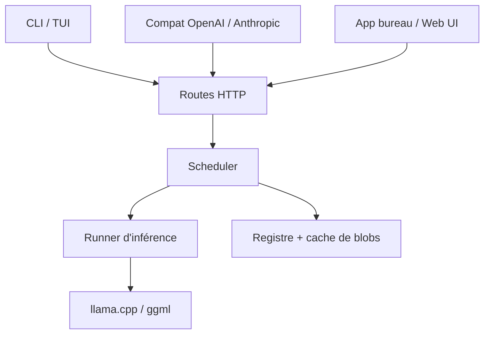

# ollama/ollama

> Serveur local de modèles ouverts, avec CLI, API REST et compatibilité OpenAI/Anthropic.

## Le problème
Faire tourner un modèle ouvert en local suppose de gérer poids, quantisation, backend et mémoire GPU.
Chaque application réinvente son branchement au lieu de parler à un endpoint stable.

## Ce que ça fait vraiment
Télécharge, stocke et sert des modèles depuis une bibliothèque publique, en une commande.
Expose une API REST sur `localhost:11434`, plus des couches de compatibilité OpenAI et Anthropic.
Lance des intégrations d'agents de code (`ollama launch claude`, codex, copilot, opencode…).
SDK Python et JavaScript officiels ; image Docker officielle ; interface de bureau et TUI.

## Comment c'est branché


## Essayer
```shell
curl -fsSL https://ollama.com/install.sh | sh
ollama run gemma4
curl http://localhost:11434/api/chat -d '{"model":"gemma4","messages":[{"role":"user","content":"Why is the sky blue?"}],"stream":false}'
```

## Coût et pièges
Gratuit, rien à payer. Le vrai coût est matériel : RAM et VRAM selon la taille du modèle choisi.
Le script d'installation est un `curl | sh` — à lire avant exécution sur une machine de travail.

## Ce que ce n'est pas
Pas un serveur d'inférence à haut débit multi-utilisateurs : c'est un runtime de poste de travail.
Pas un fournisseur de modèles : la qualité dépend entièrement du modèle téléchargé.
L'immense liste d'intégrations du README est de l'écosystème tiers, pas du code maintenu ici.

## Alternatives
- `vllm-project/vllm` : pour servir à plusieurs, avec débit et parallélisme.
- `NousResearch/hermes-agent` : si le besoin est un assistant, pas un serveur de modèles.

## Pour toi
Le socle local évident pour prototyper sans clé d'API. À garder installé en permanence.
