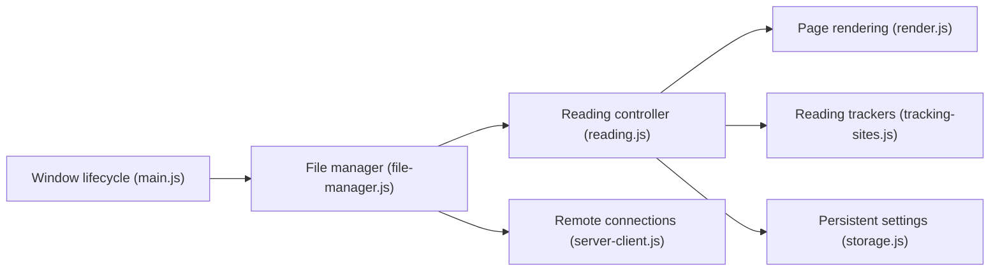

# ollm/OpenComic

> Lecteur de bandes dessinées et mangas Electron, multiplateforme, lisant archives, PDF et serveurs distants.

## Le problème
Lire des collections de comics dans divers formats (CBZ, CBR, PDF, EPUB) avec progression et réglages d'image.

## Ce que ça fait vraiment
- Lit images (JPG, AVIF, WEBP…), archives (RAR, ZIP, 7Z, CBZ…), PDF et EPUB (alpha).
- Accès à des serveurs smb, ftp, sftp, s3, webdav ; catalogues OPDS.
- Modes manga, webtoon, double page, loupe, filtres de couleur.
- Suivi AniList, MyAnimeList, Mangabaka, Bangumi.

## Comment c'est branché


## Essayer
```bash
git clone https://github.com/ollm/OpenComic.git
cd OpenComic
npm install
npm start
```

## Coût et pièges
Gratuit. Node et npm pour le développement ; sinon installeurs (exe, dmg, deb, flatpak, snap, AppImage). Si le build échoue : `npm install --force` dans `build/node-zstd-native-dependencies`.

## Ce que ce n'est pas
Pas un téléchargeur de comics. Pas de bibliothèque en ligne fournie.

## Alternatives
Aucune alternative nommée dans le README.

## Pour toi
À ignorer : application de loisir sans rapport avec ton métier, même si elle est mûre (créée en 2017).

