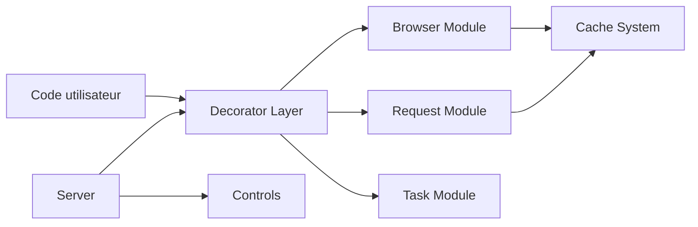

# omkarcloud/botasaurus

> Framework Python de scraping web avec navigateur automatisé, requêtes HTTP, cache, parallélisme et interface prête à l'emploi.

## Le problème
Écrire un scraper fiable demande de recoller navigateur, proxies, reprises sur erreur, cache et export. Le framework regroupe ces briques derrière trois décorateurs.

## Ce que ça fait vraiment
- `@browser`, `@request` et `@task` enveloppent une fonction Python et gèrent parallélisme, cache, réessais et sortie JSON/Excel.
- Le pilote navigateur maison vise à ressembler à un usage humain ; le README annonce qu'il passe plusieurs systèmes anti-bots. Ces affirmations viennent de l'auteur, sans mesure indépendante dans le README.
- Un module serveur génère une interface web et une API pour un scraper. Une option « Desktop » (JavaScript) en fait une application locale.
- Utilitaires : sitemap, filtrage de liens, stockage local, infos IP, déploiement sur VM ou Kubernetes.

## Comment c'est branché


## Essayer
```bash
python -m pip install --upgrade botasaurus
python main.py
git clone https://github.com/omkarcloud/botasaurus-starter my-botasaurus-project
python -m pip install -r requirements.txt
python run.py install
python run.py
```

## Coût et pièges
Le framework est gratuit. Les proxys résidentiels, la résolution de captcha (Capsolver, clé d'API) et les VM cloud sont à ta charge. Node.js est requis pour l'authentification de proxy.

## Ce que ce n'est pas
Ce n'est pas une autorisation de collecter : le README renvoie à l'utilisateur la conformité au droit (scraping, copyright, données personnelles) et aux conditions d'usage des sites visés. Les capacités de contournement de protections sont un point de vigilance juridique et éthique. L'auteur n'apporte aucune garantie de résultat.

## Alternatives
- Selenium et Playwright : standards de l'automatisation, sans orientation « anti-détection ».
- nodriver : a inspiré le pilote de Botasaurus.
- hrequests : a inspiré le module de requêtes.

## Pour toi
À surveiller : utile pour constituer des jeux de données sur des sources dont tu as le droit d'extraire les données ; vérifie d'abord les conditions d'usage de chaque site avant d'industrialiser.
