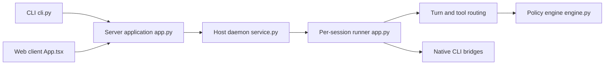

# omnigent-ai/omnigent

> Méta-harnais qui orchestre Claude Code, Codex, Cursor et agents YAML, depuis terminal, web ou mobile.

## Le problème
Chaque agent de code a son CLI, son modèle et ses règles ; les combiner, les gouverner et les partager en équipe demande du bricolage.

## Ce que ça fait vraiment
Serveur plan de contrôle (sessions, hôtes, politiques, identifiants) et hôtes lançant des runners isolés par session.
Harnais pour Claude Code, Codex, Cursor, OpenCode, Hermes, Pi, Devin, Grok ; agents custom en YAML avec outils Python, MCP et sous-agents.
Politiques : approbation avant shell, plafond d'appels, budget en dollars, à trois niveaux (serveur, agent, session).
Sandbox bwrap/seatbelt, sandboxes cloud (Modal, E2B, Daytona, Kubernetes…), UI web/desktop/mobile, partage et co-pilotage de sessions.

## Comment c'est branché


## Essayer
```bash
curl -fsSL https://raw.githubusercontent.com/omnigent-ai/omnigent/main/scripts/install_oss.sh | sh
omnigent
omnigent claude
omnigent run examples/polly/
omnigent start
```

## Coût et pièges
Modèles à ta charge (clé, abonnement ou passerelle). Nécessite uv, git, Node 22, tmux, bwrap sous Linux. Télémétrie anonymisée activée par défaut. Mode dégradé sous Windows.

## Ce que ce n'est pas
Pas un agent en soi : il pilote ceux que tu as déjà. Projet de trois mois avec plus de 1 300 issues ouvertes : surface mouvante.

## Alternatives
Aucune nommée comme concurrente (intègre OpenClaw via ACP).

## Pour toi
À surveiller : les politiques de budget et la revue croisée entre agents (Polly) répondent à un vrai besoin, mais le projet est trop jeune et trop vaste pour l'adopter en équipe maintenant.
