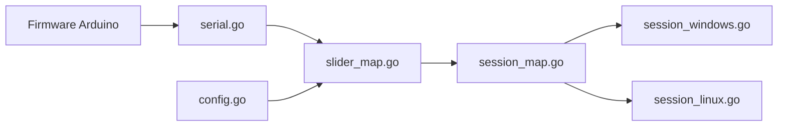

# omriharel/deej

> Mixeur de volume matériel open source : des curseurs Arduino règlent le volume des applications.

## Le problème
Changer le volume d'une application précise, jeu, musique ou vocal, oblige à quitter ce qu'on fait pour ouvrir un mélangeur logiciel.

## Ce que ça fait vraiment
Un Arduino lit des potentiomètres à glissière et envoie leurs valeurs en série par USB. Un client Go léger (environ 10 Mo de mémoire) lit le flux et ajuste le volume des sessions audio selon `config.yaml`, rechargé à chaud : master, applications, micro, sons système, périphériques nommés. Fonctionne sous Windows et Linux, icône dans la barre système.

## Comment c'est branché


## Essayer
```bash
go get -u github.com/omriharel/deej
# Arduino : flasher le sketch arduino\deej-5-sliders-vanilla
# PC : placer deej.exe et config.yaml dans le même dossier
```

## Coût et pièges
Matériel à acheter : carte Arduino, potentiomètres linéaires (pas logarithmiques), fils. Pas de binaire Linux précompilé : il faut compiler avec libgtk-3-dev, libappindicator3-dev et libwebkit2gtk-4.0-dev. Dernier push en juillet 2024.

## Ce que ce n'est pas
Pas un logiciel seul : sans la partie Arduino, il ne fait rien. L'ancienne version Python n'est plus maintenue (branche `legacy-python`).

## Alternatives
Aucune alternative nommée dans le README.

## Pour toi
Ignorer : projet de bricolage matériel sans rapport avec ton travail data/IA/MLOps.

