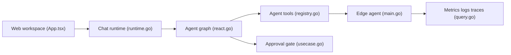

# ongridio/ongrid

> Agent IA d'exploitation qui enquête sur les incidents d'infrastructure et répond depuis Slack ou Telegram.

## Le problème
Remonter à la cause racine d'un incident oblige à croiser métriques, logs, traces et topologie à la main, souvent en pleine nuit.

## Ce que ça fait vraiment
Un coordinateur délègue à des agents spécialisés (SRE, réseau, base de données), qui interrogent métriques, logs, traces, topologie et base de connaissances. Un agent Edge se connecte en sortie, sans port entrant. Les actions risquées passent par une porte d'approbation. Modèle au choix (Anthropic, OpenAI, GLM, DeepSeek, Gemini, Kimi).

## Comment c'est branché


## Essayer
```bash
wget https://github.com/ongridio/ongrid/releases/download/v0.16.0/ongrid-v0.16.0-linux-amd64.tar.xz
tar -xf ongrid-v0.16.0-linux-amd64.tar.xz && cd ongrid-v0.16.0-linux-amd64
sudo ./install.sh
```

## Coût et pièges
Clés de modèle à ta charge. Installation en root sur Ubuntu 22.04+, Debian 12+ ou RHEL/Rocky 9. Projet jeune (créé en mai 2026), 74 issues ouvertes.

## Ce que ce n'est pas
Pas un simple chatbot : il déploie une pile complète (Prometheus, Loki, Tempo, Grafana). AGPL-3.0 : obligations en cas de service réseau modifié.

## Alternatives
Aucune alternative nommée dans le README.

## Pour toi
À surveiller : pertinent si tu opères de l'infra pour des services IA, mais jeune et lourd à installer ; attends de la stabilité avant de lui confier des actions.

