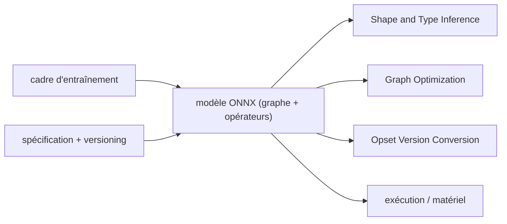

# onnx/onnx

> Format ouvert d'échange de modèles d'IA, avec ses opérateurs, ses types et ses utilitaires de graphe.

## Le problème
Un modèle entraîné dans un cadre donné y reste prisonnier : passer de la recherche à la production,
ou changer de matériel, impose une réécriture.

## Ce que ça fait vraiment
ONNX définit un modèle de graphe de calcul extensible, un jeu d'opérateurs intégrés et des types de
données standard, pour l'apprentissage profond comme pour le ML classique. Le périmètre actuel est
l'inférence. Le paquet Python fournit les utilitaires de manipulation de graphes : inférence de
formes et de types, optimisation de graphe, conversion de version d'opset. La spécification est
versionnée selon des principes publiés, et la gouvernance ouverte s'appuie sur des groupes d'intérêt
et de travail. Les roues sont abi3, donc une seule roue binaire couvre Python 3.12 et au-delà.

## Comment c'est branché


## Essayer
```sh
pip install onnx
pip install onnx[reference]
pip install pytest
pytest
```

## Coût et pièges
Gratuit, Apache-2.0 (en-tête SPDX du README). L'horodatage de construction est figé pour permettre
une comparaison octet à octet entre constructions indépendantes — utile pour la reproductibilité,
mais le README précise que cela complète les attestations de provenance sans les remplacer.
Les paquets hebdomadaires PyPI servent à l'expérimentation, pas à la production.

## Ce que ce n'est pas
Pas un moteur d'exécution : ONNX décrit le modèle, il ne l'exécute pas. Pas un format d'entraînement —
le projet se concentre explicitement sur l'inférence. Pas un convertisseur universel : chaque cadre
fournit son propre export.

## Alternatives
Aucune alternative n'est nommée dans le README ; il renvoie aux modèles pré-entraînés ONNX et aux
tutoriels de création.

## Pour toi
Le format à connaître dès que l'inférence doit sortir de Python — c'est déjà une brique de rembg dans ce lot.
