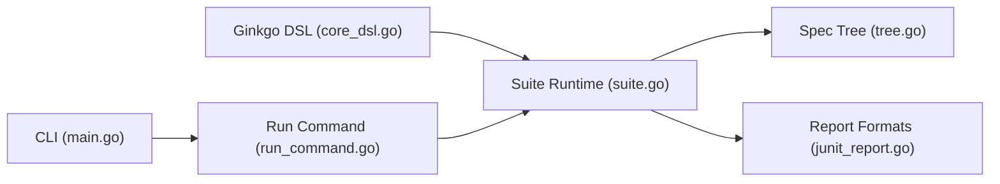

# onsi/ginkgo

> Framework de tests BDD pour Go avec CLI, à utiliser avec la bibliothèque de matchers Gomega.

## Le problème
Les tests Go standard décrivent mal l'intention, et organiser, filtrer et paralléliser de grosses suites d'intégration est laborieux.

## Ce que ça fait vraiment
DSL imbriqué (`Describe`, `Context`, `When`, `It`, `BeforeEach`…), ordre aléatoire reproductible, exécution parallèle (`ginkgo -p`), délais et nettoyage par contexte, labels pour filtrer, rapports lisibles ou machine (JUnit, etc.). CLI pour générer, lancer, profiler, mode `watch`. Fournit aussi des skills Claude Code via un plugin.

## Comment c'est branché


## Essayer
```bash
ginkgo -p
/plugin marketplace add onsi/ginkgo
/plugin install ginkgo@ginkgo
```

## Coût et pièges
Gratuit. Il faut apprendre le DSL et Gomega, et suivre les motifs de specs parallèles pour éviter l'état partagé.

## Ce que ce n'est pas
Pas un remplaçant de `go test` : il s'appuie dessus. Style BDD qui divise la communauté Go.

## Alternatives
Aucune nommée dans le README (comparaison avec Quick, RSpec, Jasmine, Busted pour le style).

## Pour toi
À surveiller : pertinent seulement si tu écris du Go (outils MLOps, opérateurs Kubernetes) avec de grosses suites d'intégration.

