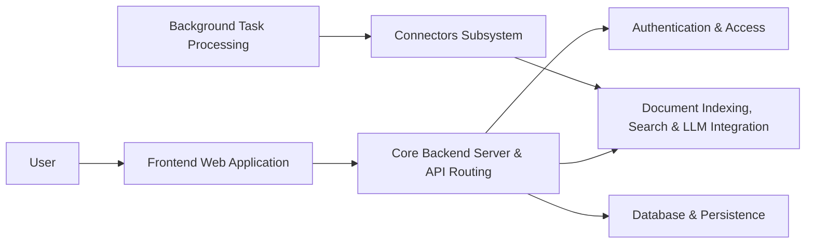

# onyx-dot-app/onyx

> Plateforme de chat LLM auto-hébergeable avec RAG sur connecteurs, agents et recherche web, pour équipes.

## Le problème
Brancher un LLM sur les documents de l'entreprise, avec droits d'accès et sources citées, demande beaucoup d'assemblage.

## Ce que ça fait vraiment
Frontend Next.js, backend Python avec 50+ connecteurs (Drive, Confluence, Slack…) synchronisés par des workers Celery.
Indexation hybride vecteur + mots-clés (Vespa), RAG agentique, deep research, agents personnalisés, MCP, exécution de code en sandbox.
Tout fournisseur LLM, auto-hébergé (Ollama, vLLM, LiteLLM) ou propriétaire.
Mode Lite (<1 Go) ou Standard (Redis, MinIO, serveurs de modèles).

## Comment c'est branché


## Essayer
```bash
curl -fsSL https://onyx.app/install_onyx.sh | bash
```

## Coût et pièges
Clé LLM à ta charge si fournisseur cloud ; mode Standard gourmand en ressources. Licence non identifiée par GitHub : README annonce MIT pour la CE et une édition Enterprise séparée.

## Ce que ce n'est pas
SSO/SCIM, RBAC fin, analytics et whitelabel relèvent de l'édition Enterprise. Pas un framework RAG à intégrer dans ton code.

## Alternatives
Aucune alternative nommée dans le README.

## Pour toi
Candidat sérieux pour un RAG interne clé en main ; vérifie le périmètre exact de la CE.
