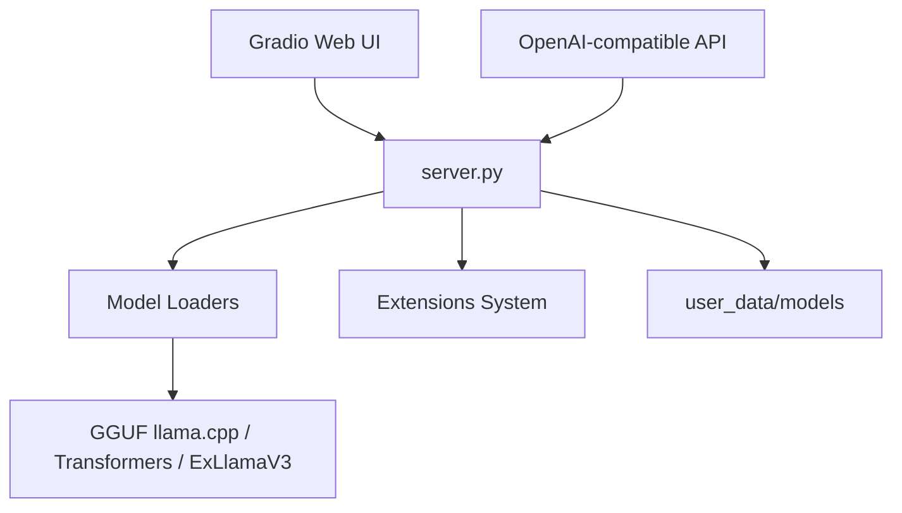

# oobabooga/text-generation-webui

> Application de bureau et interface web pour faire tourner des LLM en local, hors ligne et sans télémétrie.

## Le problème
Charger, comparer et servir des modèles locaux demande d'assembler plusieurs moteurs d'inférence.

## Ce que ça fait vraiment
Fournit chat, notebook, vision, pièces jointes, appels d'outils et MCP, entraînement de LoRA, génération d'images (diffusers) et une API compatible OpenAI et Anthropic. Backends : llama.cpp, ik_llama.cpp, Transformers, ExLlamaV3, TensorRT-LLM. Le dépôt cité est renommé « textgen ». Builds portables (CUDA, Vulkan, ROCm, CPU) ou installation complète.

## Comment c'est branché


## Essayer
```bash
git clone https://github.com/oobabooga/textgen
cd textgen
python -m venv venv
pip install -r requirements/portable/requirements.txt --upgrade
python server.py --portable --api --auto-launch
```

## Coût et pièges
Installation complète : environ 10 Go et téléchargement de PyTorch. GPU selon la taille du modèle. Mainteneur unique, avec un financement a16z mentionné.

## Ce que ce n'est pas
Pas un serveur d'inférence multi-utilisateur à grande échelle (le mode multi-utilisateur vise de petites équipes de confiance).

## Alternatives
- Aucune alternative nommée dans le README (il cite AUTOMATIC1111/stable-diffusion-webui comme inspiration).

## Pour toi
À adopter pour expérimenter des modèles locaux : une seule interface pour plusieurs moteurs, avec API compatible pour tes scripts.
