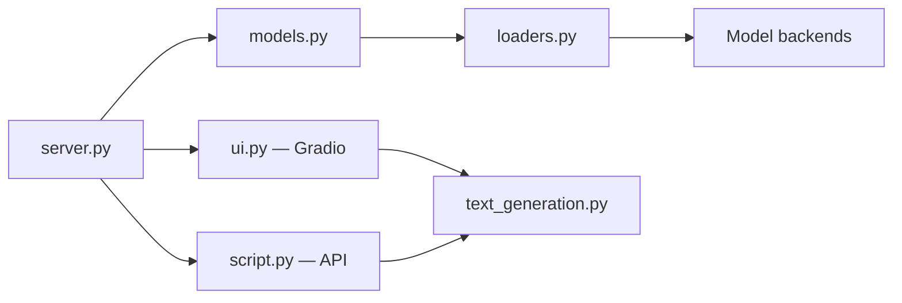

# oobabooga/textgen

> Application locale pour faire tourner des LLM : chat, API compatible OpenAI/Anthropic, LoRA.

## Le problème
Faire tourner un LLM local implique de choisir un backend, des templates de prompt et une interface, sans fuite de données.

## Ce que ça fait vraiment
Charge des modèles GGUF, Transformers, EXL3 via llama.cpp, ExLlamaV3, Transformers, TensorRT-LLM.
Interface Gradio (chat, notebook), fichiers joints, vision, outils en un fichier `.py`, MCP.
API compatible OpenAI/Anthropic ; entraînement LoRA ; génération d'images `diffusers`.
Hors ligne, sans télémétrie ; builds portables et images Docker par accélérateur.

## Comment c'est branché


## Essayer
```bash
git clone https://github.com/oobabooga/textgen
cd textgen
python -m venv venv
source venv/bin/activate
pip install -r requirements/portable/requirements.txt --upgrade
python server.py --portable --api --auto-launch
```

## Coût et pièges
Gratuit ; GPU recommandé selon le modèle. Installation complète : ~10 Go et PyTorch.

## Ce que ce n'est pas
Pas un serveur d'inférence multi-utilisateur de production (`--multi-user` réservé à de petites équipes de confiance).

## Alternatives
Non documenté (AUTOMATIC1111/stable-diffusion-webui cité comme inspiration, pas comme alternative).

## Pour toi
Pratique pour tester des modèles locaux et une API maison ; AGPL et mainteneur unique à garder en tête.
