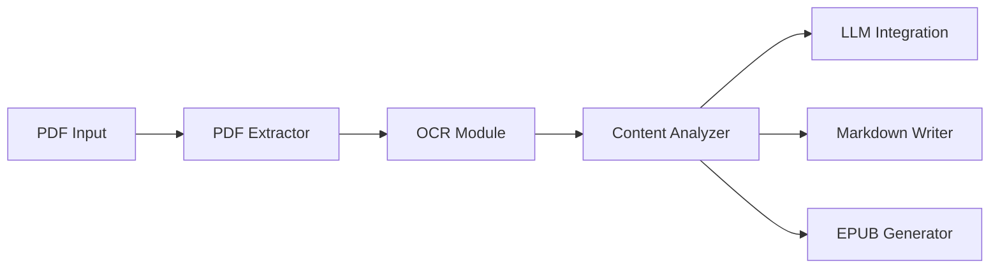

# oomol-lab/pdf-craft

> Bibliothèque Python qui convertit des PDF scannés en Markdown ou EPUB, avec traduction optionnelle.

## Le problème
Les livres et documents techniques scannés sont inexploitables tels quels : texte, chapitres, notes et tableaux sont perdus dans l'image.

## Ce que ça fait vraiment
OCR par DeepSeek OCR, DeepSeek OCR 2 ou Unlimited OCR, en local (GPU) ou via un service distant.
Reconstruit corps de texte, chapitres, table des matières, notes, tableaux, formules et images.
Sort du Markdown ou de l'EPUB ; traduction par LLM séparé, EPUB bilingue, ou PDF traduit réécrit sur les pages.
Fichier d'extraction `.pcex` réutilisable pour rendre ou traduire plus tard.

## Comment c'est branché


## Essayer
```bash
python -m pip install pdf-craft
python -m pip install "pdf-craft[local]"
```

## Coût et pièges
Poppler requis ; OCR distant payant et envoi des pages à un tiers, ou GPU CUDA avec VRAM suffisante en local.
Ghostscript et polices locales pour le PDF traduit ; qualité dépendante du scan.

## Ce que ce n'est pas
Pas un OCR généraliste bas niveau : orienté livres et documents longs.
Pas sans coût caché : la traduction sollicite un LLM distant.

## Alternatives
- Wiki Graph : pour résumer et construire des graphes de connaissances depuis les livres convertis.

## Pour toi
À surveiller : très utile pour préparer des corpus scannés pour du RAG, à tester sur un échantillon avant tout traitement de masse.
