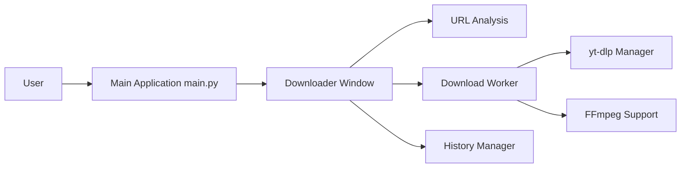

# oop7/YTSage

> Interface PySide6 autour de yt-dlp pour télécharger vidéos, audio et sous-titres.

## Le problème
yt-dlp est puissant mais en ligne de commande ; on veut choisir formats et playlists dans une interface.

## Ce que ça fait vraiment
Le GUI analyse une URL, affiche la table des formats, lance yt-dlp via un worker, puis applique conversions audio, sous-titres, SponsorBlock et découpe. Historique en base locale, cookies navigateur, proxy, mode générique pour d'autres sites, mises à jour de yt-dlp, FFmpeg et Deno intégrées.

## Comment c'est branché


## Essayer
```bash
pip install ytsage
ytsage
ytsage "https://www.youtube.com/watch?v=dQw4w9WgXcQ"
```

## Coût et pièges
Gratuit. Python 3.11 ou plus, FFmpeg requis. Les installeurs Windows peuvent être signalés par l'antivirus (faux positif selon le README). Le README rappelle le respect des conditions de YouTube.

## Ce que ce n'est pas
Ce n'est pas un moteur de téléchargement : il dépend de la version de yt-dlp installée. « Modern » et « clean » sont des qualificatifs du README.

## Alternatives
- yt-dlp : le moteur, en ligne de commande.

## Pour toi
À surveiller : commode pour récupérer des vidéos ou sous-titres en corpus, en respectant les conditions des plateformes ; simple confort sinon.

