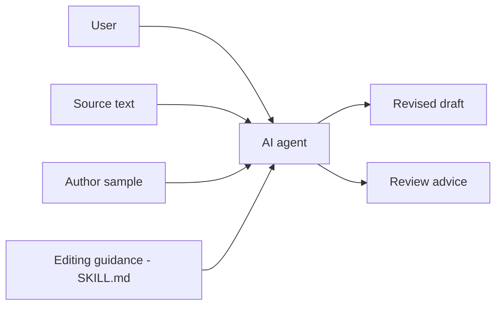

# op7418/Humanizer-zh

> Skill pour agent de code qui réécrit des textes chinois en retirant les tournures typiques d'une IA.

## Le problème
Les textes générés par IA gardent des tics : listes de trois, tournures creuses, formules de clôture.

## Ce que ça fait vraiment
Un `SKILL.md` appliqué par l'agent à un texte collé ou à un fichier : 31 points de contrôle (catégories A à F) pour retirer les tics, avec contraintes explicites : ne pas inventer de données, garder la modalité et la formulation incertaine, respecter le registre. Mode relecture seule possible, et échantillon d'auteur pour calquer la voix.

## Comment c'est branché


## Essayer
```bash
npx skills add https://github.com/op7418/Humanizer-zh.git
git clone https://github.com/op7418/Humanizer-zh.git ~/.claude/skills/humanizer-zh
```
Puis `/humanizer-zh` dans Claude Code.

## Coût et pièges
Gratuit, mais consomme du contexte et des tokens de l'agent. Le README admet que l'évaluation porte sur des échantillons limités.

## Ce que ce n'est pas
Pas un détecteur d'IA ni un programme autonome : ce sont des instructions pour un agent. Spécifique au chinois.

## Alternatives
- blader/humanizer : projet d'origine (v3.0.0), non chinois.
- hardikpandya/stop-slop : référence de style concis.

## Pour toi
À ignorer : utile seulement si tu rédiges en chinois ; hors profil data/IA/MLOps francophone.

