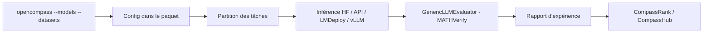

# open-compass/opencompass

> Plateforme d'évaluation de LLM : 70+ jeux de données, modèles locaux et API sur le même pied.

## Le problème
Comparer deux modèles honnêtement demande les mêmes jeux, les mêmes prompts, la même méthode de
notation — et de pouvoir tout relancer plus tard à l'identique.

## Ce que ça fait vraiment
Une ligne de commande ou un script Python décrit modèles et datasets ; la même syntaxe couvre un
modèle HuggingFace local et un modèle d'API. Évaluations zero-shot, few-shot et chain-of-thought,
avec templates de prompt standard ou dialogue. Découpage automatique des tâches et évaluation
distribuée. Backends d'accélération LMDeploy ou vLLM via `-a`. Évaluateurs récents :
`GenericLLMEvaluator` pour le LLM-as-judge, `MATHVerifyEvaluator` pour le raisonnement
mathématique, `CascadeEvaluator` pour enchaîner plusieurs évaluateurs. Intégration VLMEvalKit
pour le multimodal, et un outil d'analyse des sorties répétitives.

## Comment c'est branché


## Essayer
```bash
conda create --name opencompass python=3.12 -y
pip install -U opencompass
opencompass --models hf_internlm2_5_1_8b_chat --datasets demo_gsm8k_chat_gen
opencompass --models hf_internlm2_5_1_8b_chat --datasets demo_gsm8k_chat_gen -a lmdeploy
python tools/list_configs.py llama mmlu
wget https://github.com/open-compass/opencompass/releases/download/0.2.2.rc1/OpenCompassData-core-20240207.zip
```

## Coût et pièges
Gratuit, mais évaluer coûte : GPU pour les modèles locaux, tokens pour les modèles d'API
(`OPENAI_API_KEY`). Rupture en 0.4.0 : tous les fichiers de configuration migrent dans le paquet,
les références externes cassent. Python 3.12 en général, mais **3.10 obligatoire** si tu utilises
les datasets d'exécution de code adossés à `pyext` — sinon APPS, TACO et LiveCodeBench Code
Generation sont indisponibles.

## Ce que ce n'est pas
Ce n'est pas un classement neutre clé en main : la soumission au leaderboard passe par un e-mail
à l'équipe. Ce n'est pas un outil d'entraînement.

## Alternatives
- **VLMEvalKit** : cité comme intégration, pour les métriques officielles multimodales.

## Pour toi
L'outil à connaître dès que tu dois justifier un choix de modèle par des chiffres reproductibles.
