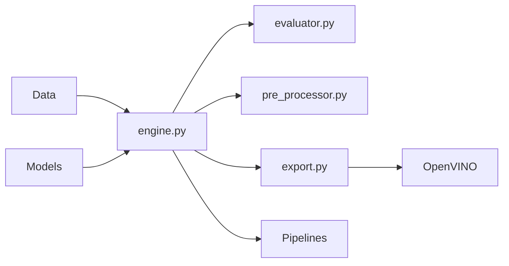

# open-edge-platform/anomalib

> Bibliothèque PyTorch Lightning d'algorithmes de détection d'anomalies visuelles, de l'entraînement au déploiement.

## Le problème
Réimplémenter et comparer PatchCore, PaDiM ou STFPM sur ses propres images industrielles coûte des semaines, et le passage en production est un chantier à part.

## Ce que ça fait vraiment
Collection de modèles image et vidéo (torch + lightning) avec datamodules pour MVTec, Visa, BTech…
Un `Engine` unique pour entraîner, prédire, benchmarker et faire de l'HPO (W&B, Comet).
Export OpenVINO et inferencers Torch/OpenVINO ; support GPU Intel XPU.
Anomalib Studio (préversion) : appli web low-code, caméras, sorties MQTT/webhook.

## Comment c'est branché


## Essayer
```bash
pip install anomalib
anomalib train --model Patchcore --data anomalib.data.MVTecAD
anomalib predict --model anomalib.models.Patchcore --data anomalib.data.MVTecAD --ckpt_path path/to/model.ckpt
anomalib benchmark --config tools/experimental/benchmarking/sample.yaml
```

## Coût et pièges
Gratuit ; GPU conseillé, backend PyTorch à choisir à l'installation (cpu, cu130, xpu). `Tabular.from_file()` refuse désormais pickle et hdf.

## Ce que ce n'est pas
Pas un outil de détection d'anomalies sur séries tabulaires ou temporelles : l'accent est visuel. Studio est une préversion instable.

## Alternatives
Aucune alternative nommée dans le README.

## Pour toi
À adopter pour tout cas de contrôle qualité visuel : référence maintenue par Intel, API Lightning familière et chemin d'export déjà fait.
