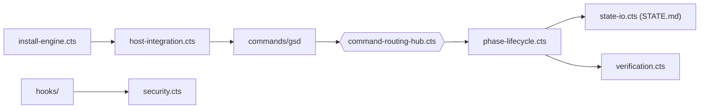

# open-gsd/gsd-core

> Cadre de développement piloté par specs qui fait tourner les agents de code en boucle de phases.

## Le problème
Plus la fenêtre de contexte d'un agent se remplit, plus sa sortie se dégrade ; d'une session à l'autre il ne garde rien, et personne ne vérifie que le code marche.

## Ce que ça fait vraiment
Installe dans l'hôte (Claude Code, Codex, OpenCode, Cursor, Copilot…) des commandes slash, skills, agents et hooks.
Chaque phase suit cinq étapes : discuter, planifier, exécuter, vérifier, livrer (PR). Le gros du travail part dans des sous-agents à contexte neuf (200k tokens chacun), par vagues parallèles, isolés en worktrees Git.
L'état survit entre sessions dans `STATE.md`, `CONTEXT.md`, roadmap et plans.
Des hooks surveillent le contexte, gardent les chemins de worktree, valident les commits et filtrent l'injection de prompt.

## Comment c'est branché


## Essayer
```bash
npx @opengsd/gsd-core@latest
# puis, dans l'agent :
# /gsd-new-project   (nouveau projet)
# /gsd-onboard       (code existant)
```

## Coût et pièges
Il faut Node et un agent de code avec son abonnement ou sa clé. Des sous-agents à 200k tokens lancés en vagues parallèles consomment vite le quota. Passer par l'installeur : copier `agents/` ou `commands/` à la main n'est pas supporté.

## Ce que ce n'est pas
Pas une application ni un service : une surcouche de prompts, commandes et hooks sur l'agent que tu utilises déjà.
Ne garantit pas la qualité : l'étape « verify » est un parcours guidé suivi de plans de correction, pas une preuve.

## Alternatives
Aucune alternative nommée dans le README.

## Pour toi
À tester sur un projet neuf si tes longues sessions dérivent ; mesure d'abord la consommation de tokens.
