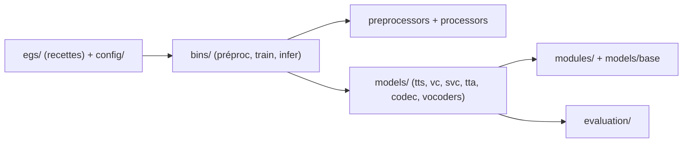

# open-mmlab/Amphion

> Boîte à outils de recherche pour générer parole, chant et audio, avec vocodeurs, codecs et métriques.

## Le problème
Reproduire des modèles de synthèse et de conversion vocale demande de réassembler données, entraînement et évaluation.

## Ce que ça fait vraiment
Modèles par tâche : TTS (FastSpeech2, VITS, VALL-E, NaturalSpeech2, Jets, MaskGCT, Vevo), conversion de voix et d'accent, conversion de chant, texte-vers-audio, codecs (DualCodec, FACodec), vocodeurs GAN/flux/diffusion. S'y ajoutent des métriques d'évaluation (F0, WER, FAD, PESQ, similarité de locuteur), le prétraitement de jeux de données dont Emilia, et l'outil de visualisation SingVisio. Chaque tâche est pilotée par des recettes dans `egs/`.

## Comment c'est branché


## Essayer
```bash
git clone https://github.com/open-mmlab/Amphion.git
cd Amphion
conda create --name amphion python=3.9.15
conda activate amphion
sh env.sh
docker pull realamphion/amphion
```

## Coût et pièges
GPU et Docker avec NVIDIA Container Toolkit pour l'image ; Python 3.9.15 imposé. Les jeux de données se montent avec `-v`. Poids pré-entraînés tiers non détaillés dans le README.

## Ce que ce n'est pas
Pas une application prête à l'emploi : c'est un cadre de recherche et d'enseignement. Le texte-vers-musique est encore « en développement ».

## Alternatives
Aucune alternative nommée dans le README.

## Pour toi
À surveiller : référence utile pour étudier ou reproduire des modèles audio, mais lourde à installer, réservée à un GPU, et dont le dernier push date de mars 2026.

