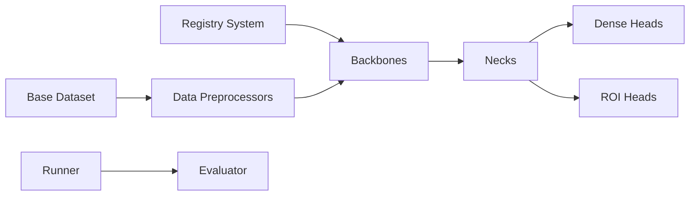

# open-mmlab/mmdetection

> Boîte à outils PyTorch de détection d'objets et segmentation, modulaire, pour chercheurs vision.

## Le problème
Comparer ou combiner des architectures de détection exige de réimplémenter backbones, necks, têtes et boucles d'entraînement.

## Ce que ça fait vraiment
Détecteurs assemblés par configuration à partir de composants enregistrés (registry) : backbones, necks, dense/ROI heads.
Détection, segmentation d'instance et panoptique, détection semi-supervisée ; des dizaines de méthodes (Faster R-CNN, DETR, DINO, RTMDet, Mask2Former…).
Model zoo de poids pré-entraînés ; MM-Grounding-DINO (v3.3.0, janvier 2024).
Repose sur MMEngine (entraînement) et MMCV.

## Comment c'est branché

## Essayer
Aucune commande documentée dans le README (installation renvoyée à la documentation).

## Coût et pièges
GPU pour l'entraînement ; dépendances MMCV/MMEngine sensibles aux versions de PyTorch. Dernier push en août 2024, 1 962 issues ouvertes.

## Ce que ce n'est pas
Pas un outil clé en main de détection : il faut maîtriser le système de configs. Plus activement développé.

## Alternatives
- Detectron2 : cité comme base de comparaison de vitesse.
- MMYOLO : famille YOLO dans le même écosystème.
- MMDeploy : pour le déploiement des modèles.

## Pour toi
Utile pour reproduire un papier ; pour un nouveau projet, vérifie la compatibilité PyTorch avant.
