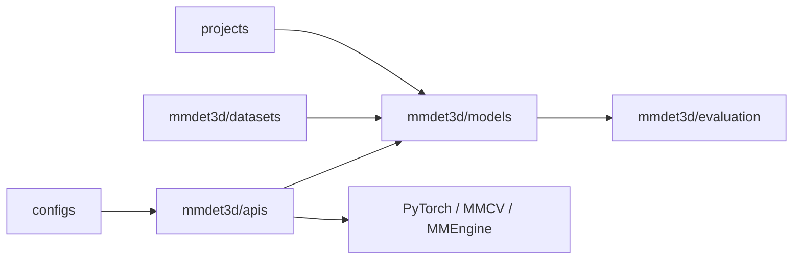

# open-mmlab/mmdetection3d

> Boîte à outils PyTorch de détection d'objets 3D (LiDAR, caméra, fusion) de l'écosystème OpenMMLab.

## Le problème
Comparer ou entraîner des détecteurs 3D demande de réimplémenter modèles, jeux de données et métriques hétérogènes.

## Ce que ça fait vraiment
Modèles LiDAR (PointPillars, SECOND, CenterPoint…), caméra (FCOS3D, DETR3D, PETR…), multimodaux (MVXNet, BEVFusion) et segmentation 3D.
Jeux KITTI, nuScenes, Waymo, Lyft, ScanNet, SUN RGB-D, S3DIS, SemanticKITTI.
Architecture par configs et registre, réutilisant MMDetection, MMCV et MMEngine.
Dernière version 1.4.0 ; dernier push en juillet 2024.

## Comment c'est branché

## Essayer
Aucune commande documentée dans le README : il renvoie au guide d'installation.

## Coût et pièges
Gratuit ; GPU requis, dépendances MMCV souvent pénibles à compiler.
Plus d'un an sans commit et 658 issues ouvertes.

## Ce que ce n'est pas
Pas activement maintenu.
Pas un outil léger d'inférence 3D prêt à l'emploi.

## Alternatives
- OpenPCDet : autre codebase de détection 3D LiDAR, comparée dans le benchmark.
- MMDetection : pour la détection 2D.

## Pour toi
À ignorer sauf besoin précis en 3D/conduite autonome : référence historique, mais figée depuis 2024.
