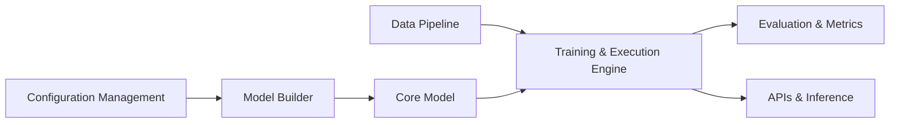

# open-mmlab/mmsegmentation

> Boîte à outils PyTorch de segmentation sémantique d'OpenMMLab, modulaire et pilotée par configs.

## Le problème
Comparer ou entraîner des méthodes de segmentation demande de réimplémenter backbones, têtes, pertes et pipelines de données à chaque fois.

## Ce que ça fait vraiment
Assemble un modèle par configuration : backbone (ResNet, Swin, ConvNeXt…), neck, decode head, loss.
Des dizaines de méthodes (PSPNet, DeepLabV3+, SegFormer, Mask2Former, SAN…) et datasets (Cityscapes, ADE20K, VOC…).
Moteur d'entraînement sur MMEngine, métriques d'évaluation, API d'inférence, outils de déploiement.
v1.2.0 ajoute segmentation open-vocabulary et estimation de profondeur.

## Comment c'est branché

## Essayer
Aucune commande dans le README (renvoi vers get_started.md et dataset_prepare.md).

## Coût et pièges
Gratuit, Apache-2.0 ; GPU pour l'entraînement. Dernier push août 2024 ; migration 0.x → 1.x à gérer.

## Ce que ce n'est pas
Pas maintenu activement : pas de release depuis fin 2023 d'après le README. Pas un outil clé en main pour non-spécialistes.

## Alternatives
- MMDetection / MMPreTrain : même écosystème pour détection et pré-entraînement.
- MMDeploy : pour le déploiement des modèles OpenMMLab.

## Pour toi
À ignorer pour un nouveau projet : riche mais en sommeil depuis 2024 ; à consulter seulement pour reproduire un papier de segmentation déjà implémenté.
