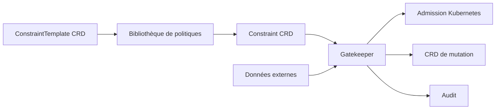

# open-policy-agent/gatekeeper

> Contrôleur d'admission Kubernetes qui applique des politiques OPA via des ressources natives.

## Le problème
Avec OPA en sidecar kube-mgmt, les politiques ne sont pas des objets Kubernetes de première classe.
Les paramétrer, les auditer et les partager se fait hors des outils habituels du cluster.

## Ce que ça fait vraiment
Une bibliothèque de politiques extensible et paramétrable, plutôt que des règles écrites à chaque fois.
Des CRD natives pour instancier ces politiques : les « constraints ».
Des CRD pour étendre la bibliothèque : les « constraint templates », plus des CRD de mutation.
Une fonction d'audit et la prise en charge de données externes.

## Comment c'est branché

## Essayer
Aucune commande documentée dans le README : il renvoie aux instructions d'installation du site.

## Coût et pièges
Gratuit, mais il faut un cluster Kubernetes et accepter un webhook d'admission sur le chemin critique.
Une politique trop large peut bloquer des déploiements légitimes : l'audit sert à mesurer avant d'appliquer.

## Ce que ce n'est pas
Pas OPA : c'est son intégration Kubernetes, avec des différences assumées face au montage en sidecar.
Pas un scanner de sécurité à posteriori — il agit à l'admission.
Le README ne décrit pas Rego ni l'écriture des politiques.

## Alternatives
OPA avec kube-mgmt (Gatekeeper v1.0) : le montage historique, sans CRD ni audit.

## Pour toi
À connaître si tu dois faire respecter des règles sur un cluster partagé ; sinon, rien pour un poste data.
