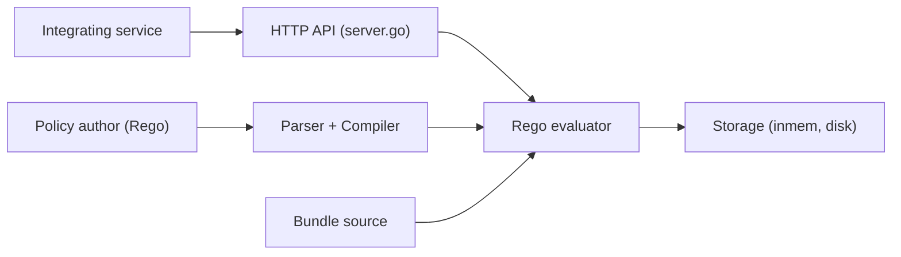

# open-policy-agent/opa

> Moteur de politiques généraliste : les services interrogent OPA pour décider d'autoriser ou non.

## Le problème
Les règles d'accès ou de déploiement codées en dur dans chaque service sont difficiles à auditer et à faire évoluer.

## Ce que ça fait vraiment
Tu écris des règles en Rego ; un service envoie une requête avec des données d'entrée, OPA évalue et renvoie la décision, que le service applique. Points d'entrée : CLI, API HTTP, SDK Go, évaluation WebAssembly. Stockage en mémoire ou sur disque, distribution par bundles.

## Comment c'est branché

## Essayer
Aucune commande dans le README ; renvoi à la documentation « Running OPA », aux images Docker Hub et aux binaires des releases.

## Coût et pièges
Gratuit. Il faut apprendre le langage Rego. Projet CNCF gradué.

## Ce que ce n'est pas
Pas un outil d'authentification : il décide, c'est ton service qui applique.

## Alternatives
Aucune alternative nommée dans le README.

## Pour toi
Adopter pour gouverner l'accès aux modèles ou aux ressources de la plateforme de façon déclarative, avec un projet gradué CNCF.

