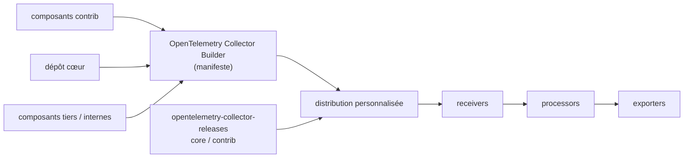

# open-telemetry/opentelemetry-collector-contrib

> Dépôt des composants du Collector OpenTelemetry qui n'ont pas leur place dans le cœur.

## Le problème
Le Collector cœur ne peut pas embarquer un récepteur ou un exporteur pour chaque backend du marché ;
sans dépôt contrib, chaque intégration vivrait dans un fork.

## Ce que ça fait vraiment
Héberge les composants hors cœur du Collector. Les distributions officielles, `core` et `contrib`,
sont publiées depuis le dépôt `opentelemetry-collector-releases` ; certains composants d'ici (Jaeger,
Prometheus) font partie de la distribution cœur, la plupart uniquement de `contrib`. Les
utilisateurs sont encouragés à construire leur propre distribution avec l'OpenTelemetry Collector
Builder, en piochant dans le cœur, dans contrib, et dans des dépôts tiers ou internes. Chaque
composant porte son niveau de support, et un niveau de stabilité **par signal** : un même composant
peut être stable en traces, alpha en métriques et en développement pour les logs. Des fonctions
restent derrière des feature gates, elles-mêmes à des stades différents.

## Comment c'est branché

## Essayer
Aucune commande documentée dans le README : il renvoie aux distributions officielles et au Collector
Builder, sans ligne de commande.

## Coût et pièges
Gratuit. Le piège est la stabilité par signal : vérifier le niveau du composant **pour le signal
qu'on utilise**, pas le composant en bloc, et surveiller les feature gates activées par défaut.

## Ce que ce n'est pas
Pas un produit installable : c'est un catalogue de composants, la distribution se construit ailleurs.
Le README est surtout un document de gouvernance (mainteneurs, approbateurs, triagers, règle de
non-sur-représentation à 25 % par employeur, processus de PR) : quasi rien sur l'usage.

## Alternatives
- La distribution `core` : suffisante si Jaeger et Prometheus couvrent le besoin.

## Pour toi
À connaître pour instrumenter une plateforme ML ; la lecture utile est le catalogue, pas ce README.
