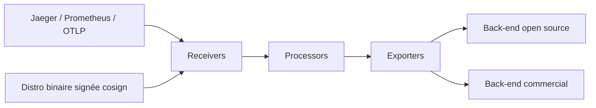

# open-telemetry/opentelemetry-collector

> Collecteur neutre qui reçoit, transforme et exporte traces, métriques et logs.

## Le problème
Chaque back-end d'observabilité impose son agent. En empiler plusieurs sur la même machine
multiplie la consommation, les configurations et les modes de panne.

## Ce que ça fait vraiment
Un seul binaire, déployable en agent local ou en collecteur central, qui reçoit les formats open
source courants (Jaeger, Prometheus, etc.) et les réexporte vers des back-ends libres ou
commerciaux. Objectifs affichés : configuration par défaut raisonnable et fonctionnelle dès
l'installation, stabilité sous charge variable, service lui-même observable, extensible sans
toucher au cœur, base de code unique pour les trois signaux. Les niveaux de stabilité et le
versionnage sont documentés composant par composant.

## Comment c'est branché


## Essayer
```bash
cosign verify \
  --certificate-identity=https://github.com/open-telemetry/opentelemetry-collector-releases/.github/workflows/base-release.yaml@refs/tags/v0.98.0 \
  --certificate-oidc-issuer=https://token.actions.githubusercontent.com \
  ghcr.io/open-telemetry/opentelemetry-collector-releases/opentelemetry-collector-contrib:0.98.0
```

## Coût et pièges
Gratuit, gouverné par la CNCF, avec une liste nommée de mainteneurs et d'approbateurs répartis
entre Grafana, Snowflake, Splunk, Dynatrace, Datadog, Elastic et Microsoft. Piège de version : en
tant que bibliothèque, le support d'une version mineure de Go `N-2` est retiré dès la première
release après la sortie de Go `N`, et ce retrait n'est pas considéré comme cassant. Les images ne
sont signées qu'à partir de la v0.95.0.

## Ce que ce n'est pas
Ce n'est pas un back-end : il ne stocke rien et n'affiche rien. Ce n'est pas instrumenté pour toi
— il faut que les applications émettent. Le README ne documente ni configuration ni installation,
seulement la vérification de signature.

## Alternatives
Aucune alternative nommée dans le README.

## Pour toi
Brique standard : si tu produis de la télémétrie, c'est le point de passage par défaut.
