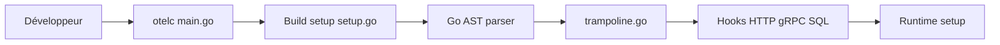

# open-telemetry/opentelemetry-go-compile-instrumentation

> Outil qui injecte l'instrumentation OpenTelemetry dans des applications Go à la compilation, sans changer le code.

## Le problème
Instrumenter une appli Go et ses dépendances demande des modifications manuelles de code.

## Ce que ça fait vraiment
`otelc` préfixe `go build` : il analyse le code (AST), applique des règles et injecte des hooks via des trampolines avant la compilation. Hooks fournis pour HTTP, gRPC, SQL, Redis, MongoDB, Kubernetes client-go. Le README annonce zéro surcharge à l'exécution (avec note de bas de page).

## Comment c'est branché


## Essayer
```bash
git clone https://github.com/open-telemetry/opentelemetry-go-compile-instrumentation.git
cd opentelemetry-go-compile-instrumentation
make build
cd demo/app/basic
../../../otelc go build
```

## Coût et pièges
Gratuit ; il faut compiler l'outil. 196 issues ouvertes ; il faut un backend OTLP pour exploiter les traces.

## Ce que ce n'est pas
Pas un backend d'observabilité. Couverture limitée aux bibliothèques ayant un hook ; le « zéro surcharge » est à nuancer.

## Alternatives
Aucune alternative citée dans le README.

## Pour toi
À surveiller : pertinent si tu sers des modèles ou services en Go ; hors Go, sans objet.

