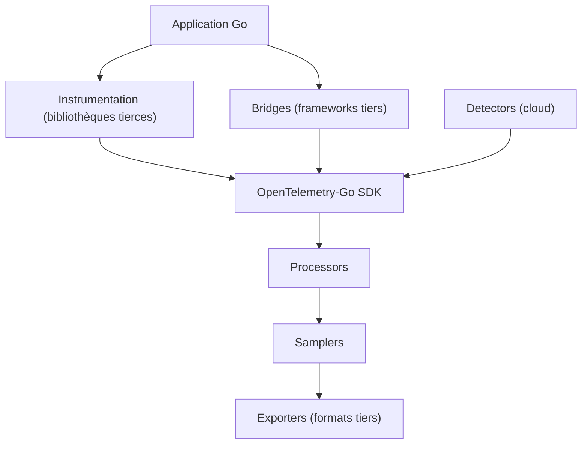

# open-telemetry/opentelemetry-go-contrib

> Le dépôt de paquets tiers d'OpenTelemetry pour Go : instrumentations, exporteurs, détecteurs.

## Le problème
Le SDK OpenTelemetry Go ne connaît pas ta bibliothèque HTTP, ton cloud ni ton format de trace
propriétaire : tout le reste vit ailleurs.

## Ce que ça fait vraiment
Rassemble huit familles de paquets. Les **instrumentations** couvrent des bibliothèques
tierces ; les **propagateurs** gèrent les formats de propagation de contexte non standard ;
les **détecteurs** identifient les ressources des environnements cloud ; les **exporteurs**
écrivent vers des formats tiers ; les **échantillonneurs** ajoutent des implémentations de
sampling ; les **ponts** adaptent des frameworks d'instrumentation tiers ; les **processeurs**
complètent ceux du SDK. Des exemples d'usage sont fournis. Le dépôt contient à la fois des
modules stables et instables : la version et les garanties de stabilité se lisent module par
module, via le manifeste de versionnement.

## Comment c'est branché

## Essayer
Aucune commande documentée : le README est un sommaire de contenus, chaque module ayant sa
propre documentation et sa propre version.

## Coût et pièges
Gratuit. Le piège est la stabilité : **le dépôt mélange modules stables et instables**, et il
faut vérifier le module précis que tu importes plutôt que le dépôt. Politique de compatibilité
Go explicite : chaque version majeure de Go est supportée jusqu'à deux versions plus récentes,
une release mineure ajoute le support d'un nouveau Go, la suivante retire le test de
compatibilité avec le plus ancien. Matrice de test : Ubuntu, macOS et Windows en Go 1.26 et
1.27, amd64, 386 et arm64 selon les cas ; rien n'est garanti ailleurs.

## Ce que ce n'est pas
Ce n'est pas le SDK OpenTelemetry-Go : c'est le dépôt des contributions autour. Ce n'est pas
un module unique versionné globalement. Et ce n'est pas un produit — c'est une collection.

## Alternatives
- Le dépôt principal opentelemetry-go, pour tout ce qui est cœur et stable.

## Pour toi
Le réflexe à avoir quand ton service Go doit exporter des traces vers un backend non standard.
