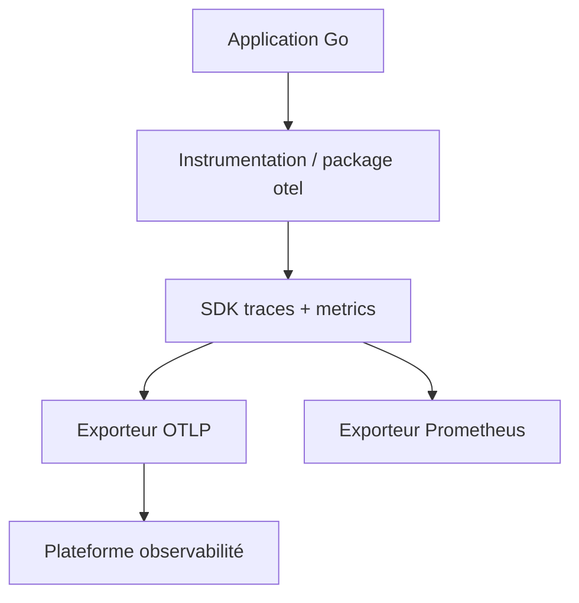

# open-telemetry/opentelemetry-go

> Implémentation Go d'OpenTelemetry : APIs pour tracer et mesurer une application.

## Le problème
Instrumenter une app Go pour envoyer traces et métriques à une plateforme d'observabilité demande un jeu d'APIs standard, faute de quoi chaque backend impose son SDK.

## Ce que ça fait vraiment
Fournit les APIs pour capturer traces distribuées et métriques et les envoyer à une plateforme d'observabilité. Traces et Metrics stables, Logs en Release Candidate. Deux étapes : instrumenter (bibliothèques d'instrumentation officielles ou package `otel`) puis configurer un exporteur (OTLP, Prometheus, stdout, Zipkin). Compatibilité alignée sur les versions Go supportées.

## Comment c'est branché

## Essayer
Aucune commande d'installation dans l'extrait de README (renvoie vers opentelemetry.io getting started et le dossier `exporters`). L'écrire : voir le guide de démarrage sur opentelemetry.io.

## Coût et pièges
Gratuit. Logs encore en RC (pas de garantie de stabilité). Compatibilité limitée aux versions Go activement supportées.

## Ce que ce n'est pas
Pas une plateforme d'observabilité : seulement les APIs/SDK côté application ; il faut un backend (Prometheus, Zipkin, etc.).

## Alternatives
Non nommées comme substituts (les exporteurs listés sont des cibles, pas des concurrents).

## Pour toi
Standard si tu instrumentes des services Go de ta stack ML ; sinon brique d'infra générale.
