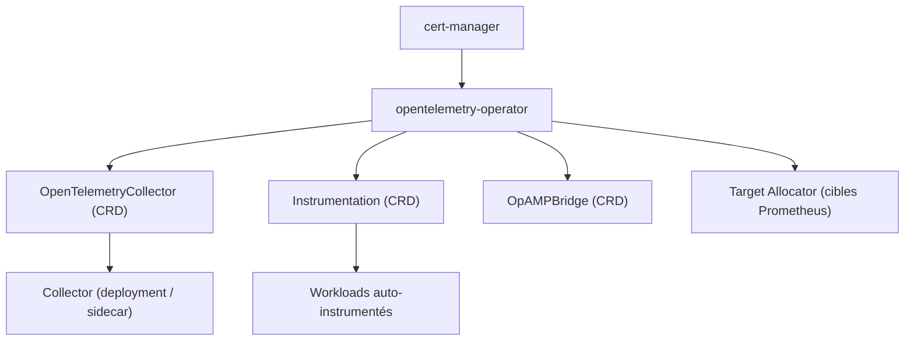

# open-telemetry/opentelemetry-operator

> Opérateur Kubernetes qui gère les collecteurs OpenTelemetry et l'instrumentation automatique.

## Le problème
Déployer un collecteur OpenTelemetry par cluster et instrumenter chaque application à la main
fait diverger les configurations aussi vite qu'on les écrit.

## Ce que ça fait vraiment
Gère deux choses : le déploiement du **OpenTelemetry Collector** via la CRD
`OpenTelemetryCollector` (plusieurs modes de déploiement, injection en sidecar, observabilité),
et l'**auto-instrumentation** des charges de travail via la CRD `Instrumentation` (injection
par langage, attributs de ressource). Deux composants supplémentaires sont documentés : le
Target Allocator, qui distribue et découvre les cibles de scrape Prometheus, et l'OpAMP Bridge
avec sa CRD `OpAMPBridge`. La documentation utilisateur vit sous `docs/` : mise en route,
concepts, cas d'usage orientés tâches, dépannage, référence d'API, changelog des CRD, portes
de fonctionnalités, et des RFC pour les propositions de conception.

## Comment c'est branché


## Essayer
```bash
kubectl apply -f https://github.com/open-telemetry/opentelemetry-operator/releases/latest/download/opentelemetry-operator.yaml
```

## Coût et pièges
Gratuit. Prérequis explicite : `cert-manager` doit être installé dans le cluster avant
l'opérateur. Une installation par Helm est possible depuis le dépôt opentelemetry-helm-charts.
Le README ne dit rien des ressources consommées par le collecteur ni du coût du backend
d'observabilité derrière — c'est là que la facture arrive.

## Ce que ce n'est pas
Ce n'est pas un backend d'observabilité : il déploie des collecteurs, il ne stocke ni
n'affiche rien. Ce n'est pas le Collector lui-même. Et l'auto-instrumentation dépend des
bibliothèques d'instrumentation OpenTelemetry par langage, pas de l'opérateur.

## Alternatives
- Le chart Helm opentelemetry-helm-charts, autre voie d'installation du même opérateur.

## Pour toi
La brique standard pour instrumenter tes services de ML en cluster sans configuration manuelle.
