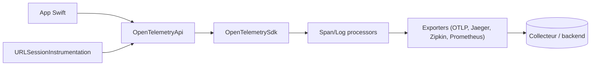

# open-telemetry/opentelemetry-swift

> Client OpenTelemetry pour Swift : API, SDK, exporteurs et instrumentation pour apps Apple.

## Le problème
Collecter traces, métriques et logs depuis une app Swift vers un backend d'observabilité exige un client conforme à la spécification OpenTelemetry.

## Ce que ça fait vraiment
`OpenTelemetryApi` définit les protocoles et implémentations sans effet ; `OpenTelemetrySdk` est l'implémentation de référence. Exporteurs : Stdout, Jaeger, Zipkin, Prometheus, OTLP gRPC/HTTP. Instrumentation de `URLSession`, état réseau et signposts. Statut : traces stables, logs en bêta, métriques sur une spécification dépassée ; OTLP HTTP expérimental, seul gRPC est prêt pour la production.

## Comment c'est branché


## Essayer
```swift
.package(url: "https://github.com/open-telemetry/opentelemetry-swift", from: "2.2.0"),
.package(url: "https://github.com/open-telemetry/opentelemetry-swift-core.git", from: "2.2.0")
```
Sous CocoaPods : `pod 'OpenTelemetry-Swift-Sdk'`.

## Coût et pièges
Gratuit ; un collecteur ou backend est à fournir. Les bibliothèques ne doivent dépendre que de l'API, l'application choisit le SDK.

## Ce que ce n'est pas
Ce n'est pas un backend d'observabilité ni un tableau de bord. Les métriques suivent une spécification obsolète, d'après le README.

## Alternatives
- Grafana/faro : exporteur tiers cité dans le README.

## Pour toi
À ignorer : utile seulement si tu instrumentes une app Swift ; pour du MLOps côté serveur, préfère les SDK Python.

