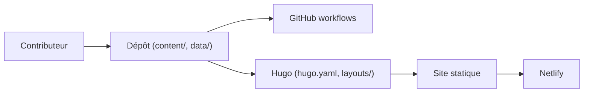

# open-telemetry/opentelemetry.io

> Sources du site, de la documentation et du blog OpenTelemetry, construits avec Hugo.

## Le problème
Il faut une source unique et contribuable pour la doc officielle d'OpenTelemetry.

## Ce que ça fait vraiment
Dépôt de contenu : pages Markdown, blog, registre de projets (données YAML/JSON), traductions (es, fr, ja, pt, zh), thèmes, scripts. Le site est généré par Hugo et hébergé sur Netlify ; des workflows GitHub vérifient orthographe et liens. Le README décrit surtout comment contribuer et les rôles (mainteneurs, approbateurs, triagers).

## Comment c'est branché

## Essayer
Aucune commande dans le README. Il renvoie au guide du contributeur (style et relecture) et au guide « Submit a blog post ».

## Coût et pièges
Gratuit. 501 issues ouvertes : la doc bouge vite. Licence CC-BY-4.0, adaptée au contenu et non au code.

## Ce que ce n'est pas
Pas le code d'OpenTelemetry (SDK, collector) : uniquement le site et la documentation.

## Alternatives
Le README ne cite aucune alternative.

## Pour toi
À adopter comme référence de lecture pour l'observabilité de tes pipelines et services ML ; le dépôt ne demande aucune installation.
