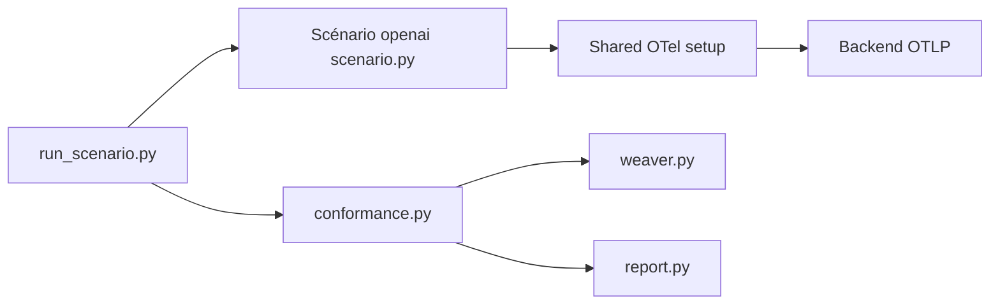

# open-telemetry/semantic-conventions-genai

> Conventions sémantiques OpenTelemetry pour l'IA générative : spans, métriques, événements, MCP et fournisseurs.

## Le problème
Chaque outil d'observabilité nomme différemment les appels LLM, ce qui empêche de comparer ou de corréler les traces.

## Ce que ça fait vraiment
Définit en YAML (dossier model, gérées avec Weaver) des conventions pour clients GenAI, MCP et fournisseurs, et génère la doc lisible. Contient des implémentations de référence Python : scénarios (Anthropic, Bedrock, CrewAI, Google ADK, LangChain, OpenAI, Vertex) qui émettent de la télémétrie, un moteur de conformité et des rapports de couverture. L'URL de schéma est encore « TODO ».

## Comment c'est branché

## Essayer
Aucune commande documentée dans le README.

## Coût et pièges
Les scénarios de référence appellent de vrais fournisseurs (clés à ta charge, d'après les noms de scénarios ; non détaillé). Dépôt jeune, 182 issues ouvertes.

## Ce que ce n'est pas
Pas une bibliothèque d'instrumentation à installer : une spécification et des exemples de conformité. Pas encore stabilisée.

## Alternatives
Aucune alternative citée dans le README.

## Pour toi
À surveiller : si tu instrumentes des applications LLM, ce standard de nommage deviendra la référence ; la lecture suffit pour l'instant.

