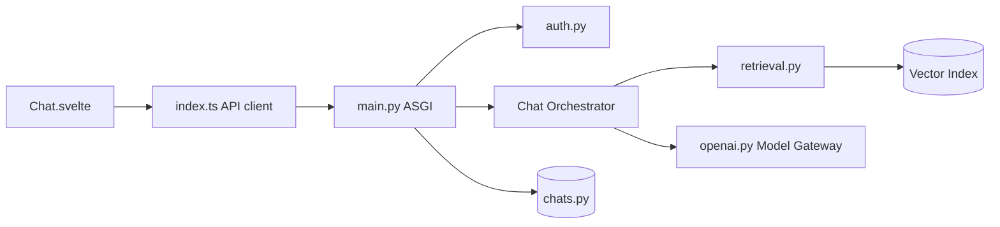

# open-webui/open-webui

> Interface web auto-hébergée de chat IA pour Ollama et toute API compatible OpenAI, avec RAG.

## Le problème
Offrir à une équipe une interface de chat sur des modèles locaux ou cloud, avec droits, documents et outils, sans passer par un SaaS.

## Ce que ça fait vraiment
Un client Svelte (`Chat.svelte`) parle à une appli ASGI Python (`main.py`) qui authentifie (`auth.py`, RBAC, LDAP, OAuth, SCIM), stocke les conversations (`chats.py`), ajoute du contexte documentaire ou web, appelle modèles et outils, puis renvoie la réponse en flux HTTP ou WebSocket.
RAG local sur 9 bases vectorielles (ChromaDB, PGVector, Qdrant…) avec recherche hybride BM25 + vecteurs et reranking ; recherche web via de nombreux fournisseurs.
Plugins (Filters, Actions, Pipes, Tools), serveurs MCP/OpenAPI, notes, canaux d'équipe, calendrier, automatisations, arène d'évaluation de modèles. SQLite ou PostgreSQL ; OpenTelemetry.

## Comment c'est branché

## Essayer
Aucune commande dans la partie lue du README : il cite pip, uv, Docker, Kubernetes et les images `:ollama` / `:cuda`, sans ligne de commande.

## Coût et pièges
Gratuit en auto-hébergement ; les modèles cloud et fournisseurs de recherche sont à ta charge. Une offre Enterprise existe (équipe commerciale).

## Ce que ce n'est pas
Ce n'est pas un moteur d'inférence : il faut Ollama, vLLM ou une API derrière. Le périmètre fonctionnel est très large (calendrier, canaux, notes) : beaucoup à configurer et à sécuriser. Licence non identifiée par GitHub : à vérifier.

## Alternatives
Aucune alternative nommée dans le README (LMStudio, vLLM, OpenRouter y figurent comme backends compatibles).

## Pour toi
À adopter comme façade de chat interne sur tes modèles, avec RAG intégré.
