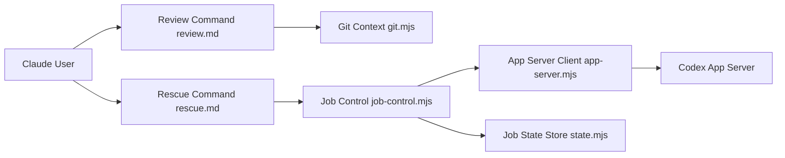

# openai/codex-plugin-cc

> Plugin Claude Code pour déléguer revues de code et tâches à Codex d'OpenAI.

## Le problème
Obtenir un second avis d'un autre agent de code oblige à changer d'outil et à perdre le contexte.

## Ce que ça fait vraiment
Commandes `/codex:review` (lecture seule), `/codex:adversarial-review` (revue orientable sur un risque), `/codex:rescue` (délégation d'un correctif), `/codex:transfer` (reprise de session dans Codex).
Gestion de jobs en arrière-plan : `/codex:status`, `/codex:result`, `/codex:cancel`.
Passe par le binaire `codex` local et son app server, avec la même config et authentification.
« Review gate » optionnelle via un hook `Stop`.

## Comment c'est branché


## Essayer
```bash
/plugin marketplace add openai/codex-plugin-cc
/plugin install codex@openai-codex
/reload-plugins
/codex:setup
npm install -g @openai/codex
/codex:review --background
```

## Coût et pièges
Abonnement ChatGPT (gratuit inclus) ou clé API OpenAI ; consomme tes quotas Codex. La review gate peut boucler et vider les quotas.

## Ce que ce n'est pas
Pas un runtime Codex séparé : dépend du CLI local. `/codex:review` ne corrige rien et n'accepte pas de consigne.

## Alternatives
Aucune alternative nommée dans le README.

## Pour toi
Pratique pour croiser les revues entre deux modèles si tu as déjà un compte ChatGPT.
