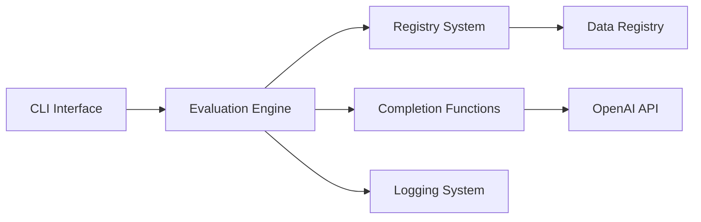

# openai/evals

> Framework et registre d'évaluations pour mesurer des LLM ou des systèmes construits dessus.

## Le problème
Sans évaluations, impossible de savoir si un changement de modèle ou de prompt améliore ou dégrade ton cas d'usage.

## Ce que ça fait vraiment
Registre d'evals (données JSON + paramètres YAML) stocké en Git-LFS ; modèles d'evals basiques et notées par un modèle, sans code.
Protocole de « completion functions » pour évaluer des chaînes de prompts ou des agents à outils ; solvers par fournisseur (OpenAI, Anthropic, Google, Together).
Journalisation optionnelle dans Snowflake.
Le README signale que les evals se configurent aussi dans le dashboard OpenAI.

## Comment c'est branché


## Essayer
```bash
pip install evals
git lfs fetch --all
git lfs pull
pip install -e .
```

## Coût et pièges
Chaque eval appelle l'API et se facture sur ta clé OpenAI. Git-LFS obligatoire pour les données du registre.

## Ce que ce n'est pas
Pas un outil neutre : il est centré sur les modèles OpenAI et les contributions servent à OpenAI. Les evals avec code personnalisé ne sont plus acceptées. Licence non identifiée par GitHub, bien que le texte parle de MIT.

## Alternatives
- OpenAI Dashboard : configuration et exécution des evals directement en ligne.
- Weights & Biases : cité comme autre moyen de lancer et créer des evals.

## Pour toi
À surveiller : les patrons d'eval (model-graded, YAML) sont une bonne référence, mais l'outil lui-même vieillit et reste lié à l'écosystème OpenAI.
