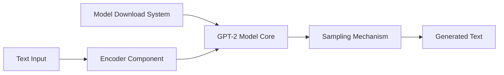

# openai/gpt-2

> Code et modèles historiques du papier GPT-2, archivés, pour expérimentation de recherche.

## Le problème
Étudier un LLM génératif de 2019 demande le code d'inférence et les poids d'origine.

## Ce que ça fait vraiment
Fournit la définition du modèle (`src/model.py`), l'encodeur BPE et l'échantillonnage.
Scripts de génération conditionnelle et non conditionnelle ; téléchargement des poids par `download_model.py`.
Dockerfiles CPU et GPU.
Pas de code d'entraînement ; un jeu de sorties est publié pour la recherche.

## Comment c'est branché

## Essayer
Aucune commande documentée dans le README (renvoi à DEVELOPERS.md).

## Coût et pièges
Gratuit ; TensorFlow 1.x d'époque. Modèles biaisés et imprécis selon OpenAI.

## Ce que ce n'est pas
Archivé, sans mises à jour. Pas un modèle utilisable en production.

## Alternatives
Aucune alternative nommée dans le README.

## Pour toi
Ignorer : valeur purement historique ; nanoGPT ou Transformers sont plus pratiques pour manipuler GPT-2.
