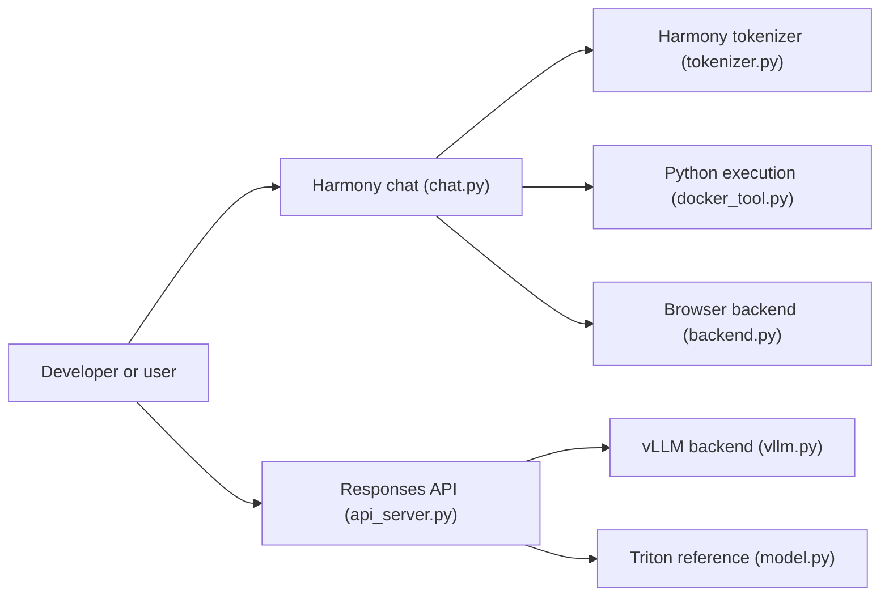

# openai/gpt-oss

> Implémentations de référence et outils pour les modèles ouverts gpt-oss-20b et gpt-oss-120b d'OpenAI.

## Le problème
Utiliser un modèle de raisonnement ouvert suppose de connaître son format de conversation, ses outils d'entraînement et une pile d'inférence qui tienne en mémoire.

## Ce que ça fait vraiment
Deux modèles MoE sous Apache 2.0 : 120b (5,1 B actifs, un GPU 80 Go) et 20b (3,6 B actifs, 16 Go), quantifiés MXFP4.
Format obligatoire « harmony » ; effort de raisonnement réglable, chaîne de pensée accessible.
Le dépôt fournit des références PyTorch (éducative, 4×H100), Triton (un GPU) et Metal, un chat terminal et un serveur Responses API.
Outils browser et python de référence ; compatibles Transformers, vLLM, Ollama, LM Studio.

## Comment c'est branché


## Essayer
```bash
pip install gpt-oss
ollama pull gpt-oss:20b
ollama run gpt-oss:20b
hf download openai/gpt-oss-20b --include "original/*" --local-dir gpt-oss-20b/
vllm serve openai/gpt-oss-20b
```

## Coût et pièges
Poids gratuits, matériel à ta charge. L'outil browser exige une clé You.com ou Exa. L'outil python tourne dans un conteneur Docker permissif.

## Ce que ce n'est pas
Les implémentations du dépôt ne sont pas faites pour la production : utiliser vLLM, Ollama ou Transformers. Sans le format harmony, le modèle répond mal.

## Alternatives
- vLLM : serveur compatible OpenAI pour la production.
- Ollama : pour du matériel grand public.
- LM Studio : interface locale.

## Pour toi
À adopter : un modèle de raisonnement ouvert, Apache 2.0, qui tient sur 16 Go en version 20b, est une option locale solide pour tes agents et pipelines.
