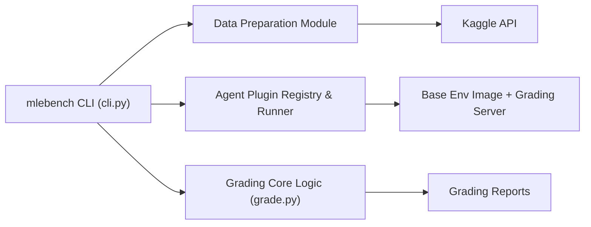

# openai/mle-bench

> Benchmark de 75 compétitions Kaggle pour évaluer des agents d'ingénierie ML.

## Le problème
Il manque une mesure commune de la capacité d'un agent à faire de vraies tâches d'ingénierie ML de bout en bout.

## Ce que ça fait vraiment
Fournit la préparation des données (découpage train/test des jeux Kaggle), la logique de notation, une image Docker de base avec serveur de validation, trois agents évalués (AIDE, OpenHands, MLAgentBench) et le classement. Sous-ensemble « Lite » de 22 compétitions. Extras : détecteur de violations de règles et de plagiat. Le classement est fermé aux nouvelles soumissions depuis avril 2026.

## Comment c'est branché


## Essayer
```bash
git lfs fetch --all
git lfs pull
pip install -e .
mlebench prepare --lite
mlebench grade-sample <PATH_TO_SUBMISSION> spaceship-titanic
docker build --platform=linux/amd64 -t mlebench-env -f environment/Dockerfile .
```

## Coût et pièges
Identifiants Kaggle (`kaggle.json`) et règles acceptées. Préparation complète : environ deux jours et 3,3 To ; Lite : 158 Go. Config de référence : 36 vCPU, 440 Go de RAM, GPU A10 24 Go, 24 h par run.

## Ce que ce n'est pas
Pas un test propre : des problèmes connus (fuites de labels, checksums) sont listés, et plusieurs soumissions du classement ne sont pas comparables (retour sur jeu de test).

## Alternatives
- openai/frontier-evals : accueillera la v2 avec correctifs.

## Pour toi
À surveiller : référence utile pour comparer des agents ML, mais le coût de calcul est très élevé et la v2 corrigera des défauts connus.
