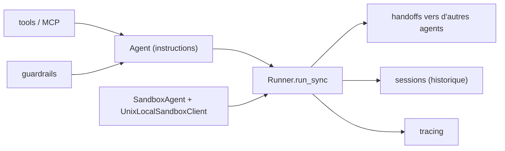

# openai/openai-agents-python

> SDK Python pour composer des agents outillés, vocaux ou en bac à sable.

## Le problème
Écrire à la main la boucle appel-modèle / appel-outil / passage de relais se refait à chaque projet.
Historique de conversation, validations d'entrée-sortie et traces sont autant de plomberie à recoder.

## Ce que ça fait vraiment
Un `Agent` est un LLM avec des instructions, des outils, des garde-fous et des relais vers d'autres agents.
`SandboxAgent` travaille dans un conteneur pour inspecter des fichiers, lancer des commandes, appliquer des patches.
`RealtimeAgent` ouvre une session WebSocket voix/multimodal ; `VoicePipeline` chaîne STT → agent → TTS.
Sessions (historique automatique), human-in-the-loop et tracing intégré ; compatible Responses, Chat Completions et 100+ LLM.

## Comment c'est branché


## Essayer
```bash
python -m venv .venv
source .venv/bin/activate
pip install openai-agents
pip install 'openai-agents[voice]'
uv add openai-agents
```

## Coût et pièges
`OPENAI_API_KEY` obligatoire avant tout exemple : chaque exécution consomme des tokens facturés.
Le bac à sable Unix ne marche que sur macOS/Linux ; sous Windows il faut Docker via l'extra `[docker]`.

## Ce que ce n'est pas
Ce n'est pas lié à un seul fournisseur — mais le chemin par défaut, la clé et les exemples sont OpenAI.
Ce n'est pas une plateforme : pas d'UI, pas de stockage, pas de déploiement fourni.
La voix exige l'extra `voice`, les sessions Redis en exigent un autre.

## Alternatives
Agents SDK JS/TS : la même bibliothèque pour un projet JavaScript/TypeScript.

## Pour toi
Le SDK d'agent le plus direct si ta stack est déjà OpenAI ; regarde `SandboxAgent` pour les tâches longues.
