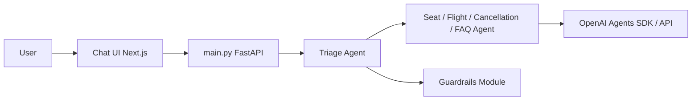

# openai/openai-cs-agents-demo

> Démo de service client multi-agents avec l'OpenAI Agents SDK et une UI Next.js de visualisation.

## Le problème
Comprendre concrètement le routage entre agents et les garde-fous est difficile à partir de la seule documentation du SDK.

## Ce que ça fait vraiment
Backend Python : agent de triage qui transmet à des spécialistes (vols, réservation, sièges, FAQ, remboursements).
Garde-fous de pertinence et anti-jailbreak visibles à l'écran quand ils se déclenchent.
Front Next.js avec ChatKit affichant l'orchestration ; données de vol factices.
Trois scénarios scriptés, dont une correspondance manquée avec relogement.

## Comment c'est branché


## Essayer
```bash
export OPENAI_API_KEY=your_api_key
cd python-backend
python -m venv .venv
source .venv/bin/activate
pip install -r requirements.txt
python -m uvicorn main:app --reload --port 8000
cd ui
npm install
npm run dev
```

## Coût et pièges
Clé OpenAI à ta charge ; verrouillé sur l'écosystème OpenAI.
Données en mémoire, aucune persistance.

## Ce que ce n'est pas
Pas un produit de support client déployable.
Pas agnostique du fournisseur de modèle.

## Alternatives
Aucune alternative nommée dans le README.

## Pour toi
À surveiller comme matériel pédagogique : bon exemple lisible de handoffs et guardrails, à ne pas prendre pour une base de production.
