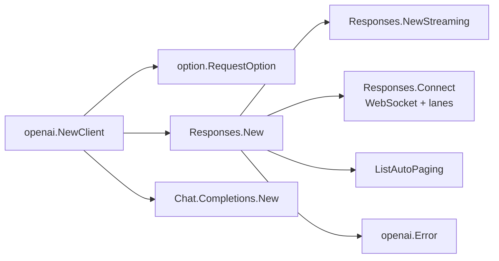

# openai/openai-go

> SDK Go officiel de l'API OpenAI, pour développeurs Go qui appellent Responses ou Chat Completions.

## Le problème
Appeler l'API à la main en Go veut dire réécrire unions, champs optionnels, pagination et retries.
La distinction « champ absent / champ null / zéro » est laborieuse en Go sans aide.

## Ce que ça fait vraiment
API primaire Responses (`client.Responses.New`), plus Chat Completions maintenu indéfiniment.
Conversations, streaming, tool calling, structured outputs via un schéma JSON généré.
Sémantique `omitzero` : `param.Opt[T]`, `param.Null`, `SetExtraFields`, unions à champs `OfXxx`.
WebSockets Responses : `Connect`, lanes (`StreamID`), `PreviousResponseID`, compaction, `Reconnect`/`Recover`.

## Comment c'est branché


## Essayer
```bash
go get -u 'github.com/openai/openai-go/v3@v3.64.0'
```

## Coût et pièges
Facture OpenAI à ta charge ; clé lue dans `OPENAI_API_KEY`. SDK ≥ v3.45.0 exige Go 1.25
(sinon épingler v3.44.0, dernière compatible Go 1.22–1.24). Les WebSockets ne marchent pas en `js/wasm`.
`Error.DumpRequest`/`DumpResponse` peuvent exposer des en-têtes d'autorisation.

## Ce que ce n'est pas
Ce n'est pas stable au sens strict : le README annonce des ruptures « petites mais réelles » à chaque version.
Ce n'est pas un client multi-fournisseurs. Les limites de service (16 réponses actives, 32 streams,
connexion de 60 minutes) sont côté serveur, pas gérées par le SDK.

## Alternatives
Aucune nommée hors dépendance `github.com/invopop/jsonschema` pour les schémas.

## Pour toi
Le choix par défaut si tu écris un service Go qui parle à OpenAI ; épingle la version.
