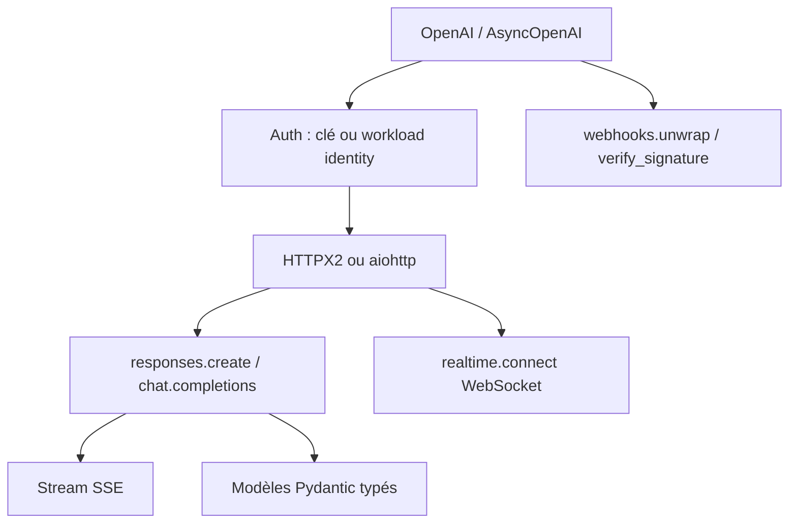

# openai/openai-python

> Client Python officiel de l'API OpenAI, typé, synchrone et asynchrone.

## Le problème
Appeler une API LLM à la main veut dire gérer soi-même retries, timeouts, pagination, streaming SSE et vérification de webhooks.
Sans types, chaque champ de réponse est une supposition.

## Ce que ça fait vraiment
Accès à l'API REST depuis Python 3.10+, avec définitions de types pour tous les paramètres et champs de réponse, généré depuis la spécification OpenAPI ; clients synchrone et asynchrone sur HTTPX2.
API principale Responses (`client.responses.create`), API Chat Completions maintenue indéfiniment, vision par URL ou base64, Realtime en WebSocket pour texte et audio.
Authentification par clé, ou identité de charge de travail à jetons courts : jetons de compte de service Kubernetes, identité managée Azure, métadonnées GCP, fournisseur personnalisé, et X.509 en mTLS avec endpoint `mtls.api.openai.com`.
Itérateurs auto-paginés, streaming SSE, upload de fichiers, vérification et parsing de webhooks (`client.webhooks.unwrap`), retries par défaut (2) avec backoff, timeout par défaut de 10 minutes, `_request_id` sur chaque réponse.

## Comment c'est branché


## Essayer
```sh
pip install openai
pip install openai[aiohttp]
```

```shell
export OPENAI_LOG=info
```

## Coût et pièges
La bibliothèque est gratuite ; chaque appel est facturé par OpenAI.
Le README recommande python-dotenv plutôt que la clé en dur ; les requêtes en timeout sont réessayées deux fois par défaut, ce qui peut doubler une facture sur des appels lourds.

## Ce que ce n'est pas
Ce n'est pas un framework d'agents : c'est un client HTTP typé.
Ce n'est pas indépendant du fournisseur : rien ici n'abstrait OpenAI.
La consommation d'un `Stream` n'est pas réessayée automatiquement, pour ne pas dupliquer une sortie déjà livrée : à gérer côté application. Le README fourni est tronqué dans la section « Accessing raw response data ».

## Alternatives
Aucune alternative n'est nommée dans le README.

## Pour toi
Utile comme référence d'implémentation d'un SDK LLM propre (retries, request-id, workload identity) même si tu ne l'emploies pas.
