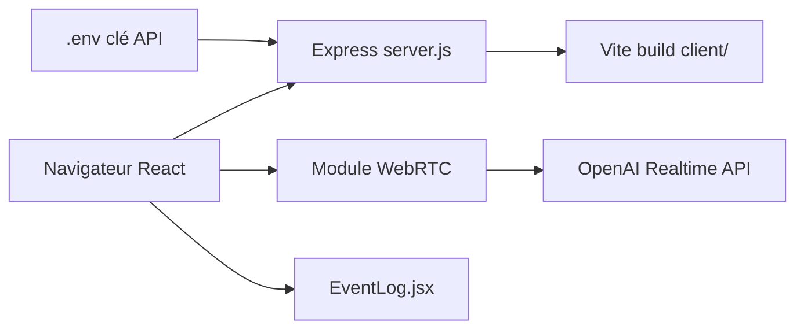

# openai/openai-realtime-console

> Application d'exemple qui montre l'API Realtime d'OpenAI en WebRTC, pour développeurs voix.

## Le problème
Brancher l'API Realtime demande de comprendre le canal de données WebRTC et les événements client/serveur.

## Ce que ça fait vraiment
Un serveur Express sert un front React (dossier `client/`, construit par Vite). Le navigateur ouvre une session WebRTC vers l'API Realtime, envoie et reçoit les événements sur le canal de données, configure des appels de fonction côté client et affiche les charges JSON dans un panneau de journal (`EventLog.jsx`).

## Comment c'est branché


## Essayer
```bash
cp .env.example .env
npm install
npm run dev
# http://localhost:3000
```

## Coût et pièges
Clé OpenAI dans `.env`, facturation à l'usage de l'API Realtime. Node.js requis. Dernier push en août 2025.

## Ce que ce n'est pas
Un gabarit minimal, pas une application complète : le README renvoie vers un autre dépôt (Realtime Agents, Next.js) pour un exemple plus riche. L'ancienne version en WebSockets est déconseillée pour les navigateurs.

## Alternatives
« OpenAI Realtime Agents », démo Next.js à architecture d'agents, nommée dans le README.

## Pour toi
À surveiller comme point de départ pour un prototype vocal sur l'API Realtime : MIT et court à lire, mais lié à un service payant et peu mis à jour.
