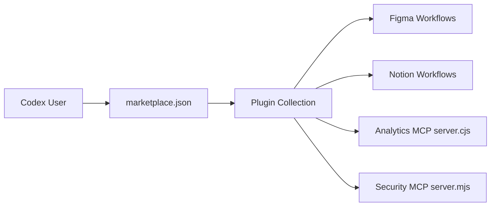

# openai/plugins

> Collection d'exemples de plugins pour Codex (skills, MCP, apps), pour utilisateurs de Codex.

## Le problème
Écrire un plugin Codex sans exemple de manifeste et de surfaces (skills, MCP, hooks) est tâtonnant.

## Ce que ça fait vraiment
Chaque plugin vit dans `plugins/<nom>/` avec un manifeste `.codex-plugin/plugin.json` et des surfaces optionnelles.
Une marketplace par défaut `.agents/plugins/marketplace.json`, une autre pour les connexions par clé API.
Exemples riches : Figma, Notion, iOS/macOS, apps web, Expo, Netlify, Remotion, Google Slides.
README court : le détail des plugins n'est pas documenté ici.

## Comment c'est branché

## Essayer
Aucune commande documentée dans le README.

## Coût et pièges
Nécessite Codex (compte OpenAI) ; les plugins s'appuient sur des services tiers (Figma, Notion…).
Aucune licence déclarée : réutilisation du code juridiquement floue.

## Ce que ce n'est pas
Pas une bibliothèque installable ni un SDK documenté.
Pas compatible Claude Code tel quel.

## Alternatives
Aucune alternative nommée dans le README.

## Pour toi
À ignorer sauf si tu développes pour Codex : pas de licence, README maigre, écosystème propriétaire.
