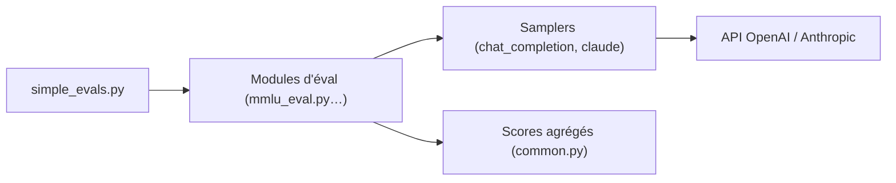

# openai/simple-evals

> Petite bibliothèque d'OpenAI pour évaluer des modèles de langage en zero-shot avec chaîne de raisonnement.

## Le problème
Les évaluations dépendent fortement du prompt (few-shot, jeu de rôle) et les chiffres publiés sont difficiles à comparer.

## Ce que ça fait vraiment
Un module par benchmark (MMLU, MATH, GPQA, DROP, MGSM, HumanEval, SimpleQA, BrowseComp, HealthBench) et des « samplers » pour l'API OpenAI et Claude. Le script `simple_evals.py` liste les modèles, lance l'évaluation et agrège les scores. Le dépôt publie aussi un tableau de résultats pour les modèles OpenAI et d'autres modèles rapportés.

## Comment c'est branché


## Essayer
```bash
pip install openai
pip install anthropic
python -m simple-evals.simple_evals --list-models
python -m simple-evals.simple_evals --model <model_name> --examples <num_examples>
```

## Coût et pièges
Chaque évaluation consomme des appels d'API payants. Il n'y a pas d'installation unifiée : chaque eval et chaque sampler a ses dépendances (HumanEval se clone à part).

## Ce que ce n'est pas
Plus mis à jour pour les nouveaux modèles depuis juillet 2025, les PR et issues ne sont pas suivies, et aucune nouvelle éval n'est acceptée. Ce n'est pas un remplaçant de `openai/evals`. Reste maintenu comme référence pour HealthBench, BrowseComp et SimpleQA.

## Alternatives
- openai/evals : collection complète d'évaluations.

## Pour toi
À surveiller : sert de référence lisible pour reproduire SimpleQA ou BrowseComp, mais il est figé, donc pas de socle pour un banc d'évaluation durable.
