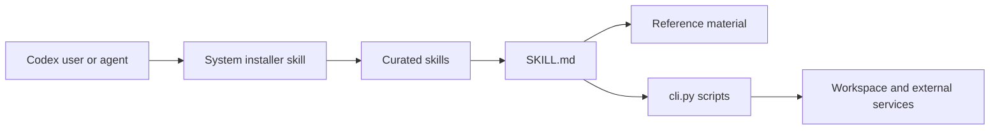

# openai/skills

> Catalogue déprécié de skills pour Codex, remplacé par le dépôt OpenAI Plugins.

## Le problème
Donner à Codex des capacités réutilisables (déploiement, CI, design) sans réécrire les instructions à chaque fois.

## Ce que ça fait vraiment
Chaque skill est un dossier avec `SKILL.md`, métadonnées `agents/openai.yaml`, licence et scripts éventuels.
Trois tiers : `.system` (installés d'office), `.curated`, `.experimental`.
Installation par le skill `$skill-installer` dans Codex, redémarrage requis.
Intégrations décrites : GitHub, Cloudflare, Figma, Notion, API OpenAI.

## Comment c'est branché


## Essayer
```bash
$skill-installer gh-address-comments
```

## Coût et pièges
Gratuit, mais lié à Codex ; dépôt déprécié. Licences au niveau de chaque skill, aucune au niveau du dépôt.

## Ce que ce n'est pas
Plus maintenu comme source de référence : les exemples actuels sont dans OpenAI Plugins.

## Alternatives
- OpenAI Plugins : le dépôt qui remplace celui-ci.

## Pour toi
Ignorer : déprécié et centré Codex ; au mieux une source d'inspiration pour écrire tes propres skills Claude.
