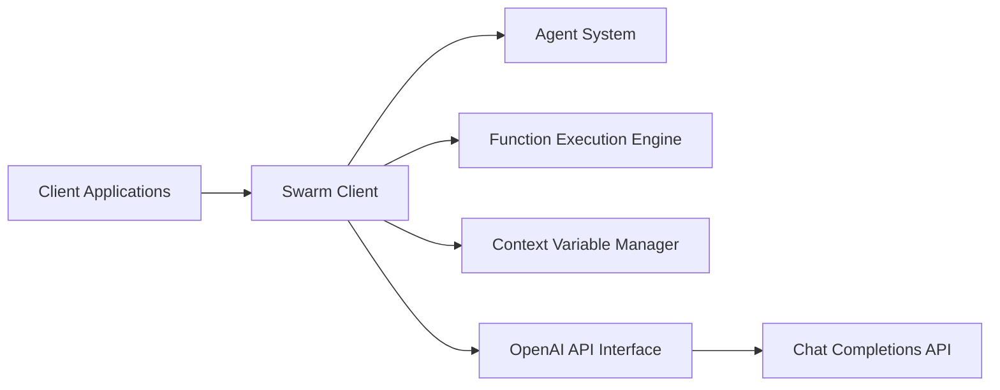

# openai/swarm

> Bibliothèque éducative d'orchestration multi-agents par handoffs, remplacée par l'OpenAI Agents SDK.

## Le problème
Coder plusieurs agents qui se passent la main sur une conversation mène vite à des boucles ad hoc peu testables.

## Ce que ça fait vraiment
Deux primitives : `Agent` (instructions + fonctions) et handoff (une fonction qui retourne un autre agent).
`client.run()` boucle : complétion, exécution des outils, changement d'agent, mise à jour des `context_variables`, arrêt sans nouvel appel.
Sans état entre appels, basé sur Chat Completions ; conversion automatique des fonctions en JSON Schema, streaming, REPL de démo.
Exemples : triage, support client, compagnie aérienne.

## Comment c'est branché


## Essayer
```bash
pip install git+https://github.com/openai/swarm.git
```

## Coût et pièges
Chaque tour consomme ta clé OpenAI. Installation depuis Git uniquement, Python 3.10+.

## Ce que ce n'est pas
Pas destiné à la production : le README renvoie explicitement à l'Agents SDK. Sans rapport avec l'Assistants API malgré le nom. Pas de mémoire persistée.

## Alternatives
- OpenAI Agents SDK : successeur maintenu, recommandé pour tout usage en production.
- Assistants API : si tu veux threads hébergés, mémoire et retrieval.

## Pour toi
À ignorer pour construire, à lire pour comprendre : le code est court et montre bien le patron handoff, mais le projet n'évolue plus.
